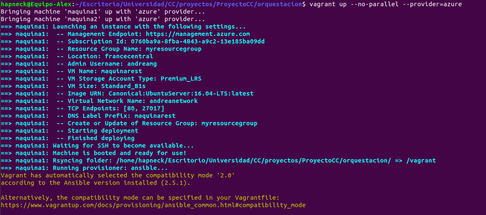
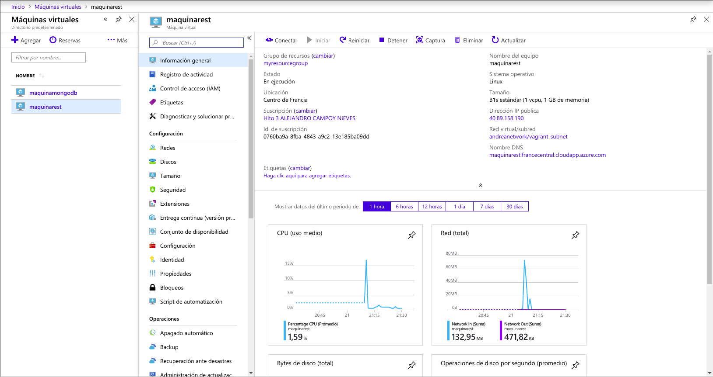
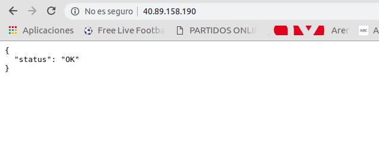
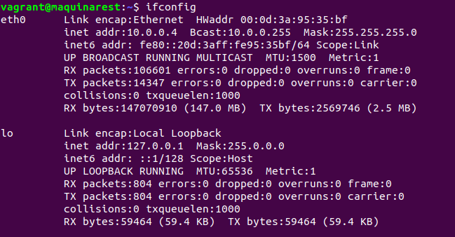

# Prueba de Orquestación de Maquinas Virtuales

Autor: Alejandro Campoy Nieves (@AlejandroCN7)

Para: Andrea Morales Garzón (@andreamorgar)

---

## Procedimiento

Primero he clonado su repositorio:

`> git clone https://github.com/andreamorgar/ProyectoCC.git`

Después, he accedido a su carpeta llamada "orquestacion" y he ejecutado lo siguiente:

`> vagrant up --no-parallel --provider=azure`

He obtenido lo siguiente:

En mi cuenta de azure tengo:

Como se puede apreciar en la imágenes, se han creado dos máquinas. Según Andrea, una es para el servicio REST y la otra para alojar el servicio de MongoDB con la base de datos que utilizará la primera máquina mencionada.

El siguiente paso es acceder a la primera máquina y comprobar que puede dar el servicio:

`> ssh vagrant@40.89.158.190`

`> cd ProyectoCC`

`> sudo python3 app_flask.py`

Estos son los comandos necesarios a ejecutar en la máquina. Obtuve los siguientes resultados:

Probé a hacer peticiones GET desde el navegador (averigüé la IP pública de la máquina a través de mi cuenta de Azure):

Como podemos apreciar, los resultados son satisfactorios.

También entré en la máquina de MongoDB para comprobar que el servicio estaba funcionando.

`> ssh vagrant@40.89.158.172`

`> systemctl status mongodb`

Obtuve por terminal lo siguiente:

Podemos comprobar que el servicio está levantado. A continuación, accedí a los logs para asegurarme de que las peticiones realizadas anteriormente fueron escuchadas por esta base de datos:

`> cat /var/log/mongodb/mongodb.log`

10.0.0.4 es la IP de la primera máquina que da el servicio REST, ya que en ella ejecuté `ifconfig` para asegurarme:

`> ifconfig` (en la primera máquina)

A modo de conclusión, las máquinas han sido orquestadas perfectamente ya que el sistema funciona como debería y la comunicación es satisfactoria.
