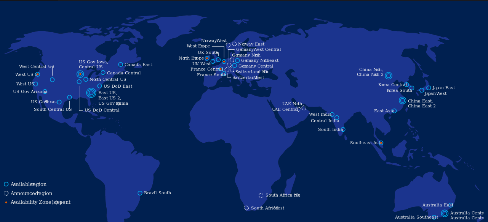
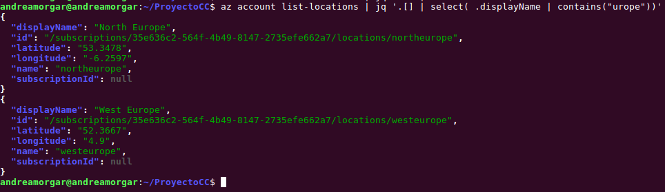
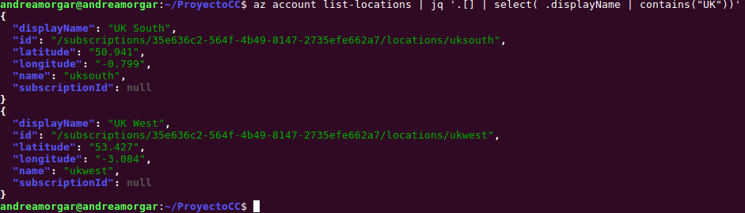
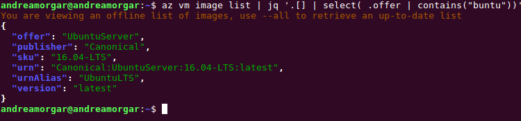

# Automatización de la creación de máquinas virtuales desde línea de órdenes

## 1. Instalación del CLI de Azure
El primer paso que tenemos que llevar a cabo es instalar el cliente de Azure, para poder trabajar con las máquinas virtuales desde línea de órdenes. Para su instalación, podemos seguir los pasos en la documentación oficial, que se puede consultar [aquí](https://docs.microsoft.com/es-es/cli/azure/install-azure-cli?view=azure-cli-latest). En mi caso, como ya utilicé la CLI de Azure en el hito anterior, ya tengo la instalación necesaria en mi sistema, pero bastaría con ejecutar la siguiente orden
~~~
$ sudo apt-get install azure-cli
~~~

## 2. Creación de una máquina virtual en la nube

Una vez realizada la instalación, ya podemos crear una máquina virtual en la nube. Lo primero que tenemos que realizar, es la elección de la imagen que queramos utilizar, la cual contendrá, tanto el sistema operativo, como cualquier otra utilidad con la que queramos trabajar.

### Escoger la localización
Azure tiene una gran cantidad de regiones globales, manteniendo así la resistencia de sus datos. Se entiende por región a un conjunto de centros de datos, que se encuentran dentro de una zona perimetrada (caracterizada por la latencia). Estos centros de datos, se conectan a través de una red a nivel de región, la cuál es de baja latencia.  En la siguiente imagen, obtenida de la [documentación oficial de Azure](https://azure.microsoft.com/es-es/global-infrastructure/regions/), se puede consultar toda esta información.

A la hora de decantarnos por una localización concreta, tenemos que tener en cuenta aspectos como puede ser la latencia que pueda existir, condicionada a la localización que escojamos. Por ello, vamos a elegir una serie de localizaciones cercanas a la zona geográfica en la que nos encontramos, y realizaremos mediciones para así poder ver qué región es la más adecuada para ubicar la máquina virtual en la que desplegar el servicio.

Para ello, en primer lugar vamos a limitar la elección a Europa (como es de esperar). Teniendo en cuenta tanto la región como la ubicación concreta del centro de datos, vamos a probar las regiones  **Norte de Europa**, **Oeste de Europa**, **Centro de Francia**, **Sur de Francia** y **Oeste de UK**.

Ahora, sólo nos faltaría saber cuál es el nombre asociado a cada una de esas regiones, mediante el cuál se identifican a la hora de utilizarlas directamente mediante **az**. Para ello, podemos hacer uso de la siguiente orden
~~~
$ az account list-locations
~~~

Sin embargo, como es de esperar, de esta forma se nos facilita un listado con todas las regiones disponibles de Azure, y nosotros no buscamos eso, sino simplemente queremos saber aquellas que nos interesan. Para ello, podemos usar la funcionalidad **jq** y filtrar esa lista, de forma que obtengamos únicamente lo que nos interesa. En la siguiente imagen, podemos ver cómo sería la salida obtenida, filtrando por urope (en lugar de Europe, ya que no sabemos si la primera letra estará en mayúscula o en minúscula).

Con la orden anterior, obtenemos información para aquellas localizaciones en cuyo nombre aparece Europe, pero de las que comentamos anteriormente, sólo es el caso de las dos primeras (norte y oeste de Europa). Realizando el mismo filtrado de información para UK y Francia (filtrando por ''*UK*'' y ''*rance* '' en lugar de *France* o *france* por la misma razón ya comentada), podemos obtener toda la información necesaria para poder crear grupos de recursos en estas localizaciones.

De esta forma, obtenemos los nombres que debemos utilizar para hacer referencia a dichas regiones.
* **Norte de Europa**: northeurope
* **Oeste de Europa**: westeurope
* **Centro de Francia**: francecentral
* **Sur de Francia**: francesouth
* **Oeste de UK**: ukwest

<!--
* **Norte de Europa**:
  * nombre: northeurope
  * latitud: 53.3478
  * longitud: -6.2597

* **Oeste de Europa**
  * nombre: westeurope
  * latitud: "52.3667"
  * longitud: "4.9"

* **Centro de Francia**:
  * nombre: francecentral,
  * latitud: "46.3772"
  * longitud: "2.3730"

* **Sur de Francia**:
  * nombre: francesouth
  * latitud:"43.8345"
  * longitud: "2.1972"

* **Oeste de UK**:
  * nombre: ukwest
  * latitud:"53.427"
  * longitud: "-3.084" -->

#### Medición de las latencias
Para poder realizar las mediciones para una localización concreta, debemos seguir los siguientes pasos.
1. En primer lugar deberemos crear un grupo de recursos en la región que queramos realizar la medición.

2. Una vez creado el grupo de recursos, tenemos que crear una máquina virtual especificando como grupo de recursos el recién creado.

3. Debemos provisionar la máquina virtual con nuestro servicio, y arrancarlo, de forma que podamos realizar peticiones al mismo.

4. Utilizar una herramienta que nos permita realizar la medición, lanzando peticiones a nuestro recurso. Para ello se ha hecho uso de la herramienta [Apache Bench](https://httpd.apache.org/docs/2.4/programs/ab.html) (AB). Se ha elegido esta herramienta, por su facilidad y rapidez de uso,  ya que podemos usarla de forma rápida y simple para medir la latencia de nuestra aplicación.

>## aqui hay que mencionar algo de ab

<u>Región **Norte de Europa**</u>:

>## AQUÍ HAY QUE PONER TODAS LAS CAPTURAS DE AB,Y  DE LA CREACIÓN DE LAS MÁQUINAS.

| Región            | Test 1 (ms) | Test 2 (ms) | Test 3 (ms) | Media (ms) |
|-------------------|-------------|-------------|-------------|------------|
| Norte de Europa   | 124.57      | 117.85      | 121.37      | 121.26     |
| Oeste de Europa   | 104.54      | 105.42      | 106.86      | 105.61     |
| Centro de Francia | 86.591      | 83.551      | 84.58       | 84.91      |
| Oeste de UK       | 124.51      | 105.72      | 136.48      | 122.24     |
| Sur de Francia    | ---         | ---         | ---         | ---        |

Como se puede observar en la tabla, **la región con la que se tiene menor latencia es France Central, por lo que será la más adecuada a utilizar en vistas a crear una máquina virtual en la que desplegar nuestra aplicación. **

### Escoger la imagen
El primer paso es **escoger la imagen**. Para ello, usamos la siguiente orden, que nos permite ver un listado de las imágenes disponibles.

~~~
$ az vm image list
~~~

Si nos interesa por ejemplo, conocer únicamente las distribuciones de Ubuntu disponibles, podemos filtrar esta lista para ello, mediante la orden que se muestra a continuación

~~~
$ az vm image list | jq '.[] | select( .offer | contains("buntu"))'
~~~

Si ejecutamos dicha línea, se obtiene como salida lo siguiente.

Para conocer la IP, que tiene que ir en el script de ansible:
https://github.com/Azure/azure-cli/issues/2677

## 3. Realizar peticiones con Apache Bench (AB)

https://blog.diacode.com/testeando-el-rendimiento-de-tu-aplicacion-con-apache-bench

https://kuntalchandra.wordpress.com/2015/10/10/install-apache-bench-ubuntu-14-04/

Para realizar peticiones:
~~~
$ ab -g results.tsv -n 100 -c 20 http://137.117.174.154/
~~~

---

## acopio.sh

1. Tenemos que crear el grupo de recursos a utilizar
2. Crear la máquina virtual con ese grupo de recursos
3. Necesitamos saber la IP, para pasarsela al playbook de ansible **Duda: hacemos un nuevo playbook, o modificamos el de provisionamiento? Porque ahora cambiará ya que le estamos pasando variables...**. Para ello, podemos usar [esto](https://github.com/Azure/azure-cli/issues/2677), y
además tenemos que filtrar la búsqueda en función del nombre de usuario que le ponemos a nuestra
máquina. Podemos usar jq, tal y como viene [aquí](https://stedolan.github.io/jq/manual/#Basicfilters)
4. Ya faltaría ejecutar el playbook de ansible pasándole los parámetros y tal.

Modificar ip a estática [aquí](https://docs.microsoft.com/ga-ie/azure/virtual-network/virtual-network-network-interface-addresses)

Enlace para az vm [aquí](https://docs.microsoft.com/en-us/cli/azure/vm?view=azure-cli-latest)

Para ver como meter la IP: [aqui](https://stackoverflow.com/questions/44592141/ansible-ad-hoc-command-with-direct-host-specified-no-hosts-matched)
-----

Nos sale un error y [aqui](https://github.com/ansible/ansible/issues/19584) dice que es pq no especificamos el usuario
## Avance del proyecto

Para este hito, vamos a realizar un avance en el proyecto, que consiste en añadir la utilidad de logs a nuestra aplicación.

Para ello, vamos a utilizar la librería **logging** de Python, que nos permitirá poder gestionar los distintos mensajes que se deban enviar en nuestra aplicación. Para este avance, se ha seguido el siguiente tutorial, al que se puede acceder [aquí](https://realpython.com/python-logging/).

Podríamos guardar los logs en una nueva colección de la base de datos, como viene indicado [aquí](https://stackoverflow.com/questions/8103864/logging-to-mongodb-from-python)
