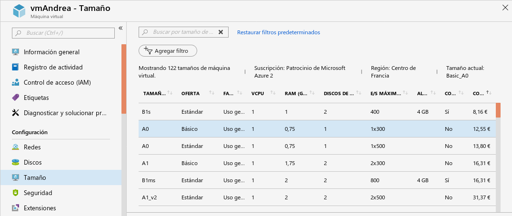
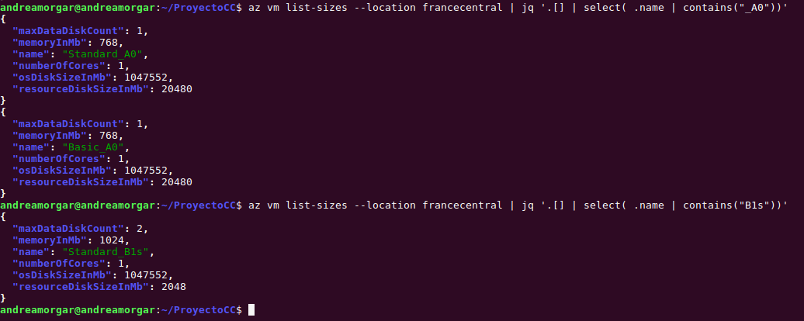
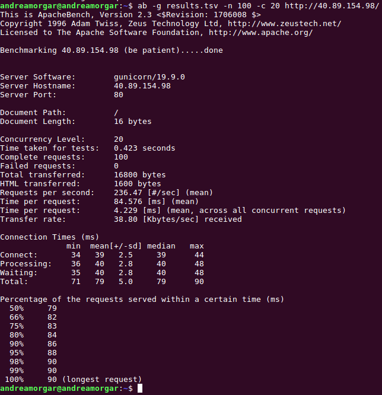
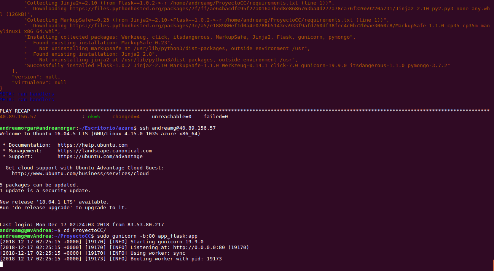

# Automatización de la creación de máquinas virtuales desde línea de órdenes

## 1. Instalación del CLI de Azure
El primer paso que tenemos que llevar a cabo es instalar el cliente de Azure, para poder trabajar con las máquinas virtuales desde línea de órdenes. Para su instalación, podemos seguir los pasos en la documentación oficial, que se puede consultar [aquí](https://docs.microsoft.com/es-es/cli/azure/install-azure-cli?view=azure-cli-latest). En mi caso, como ya utilicé la CLI de Azure en el hito anterior, ya tengo la instalación necesaria en mi sistema, pero bastaría con ejecutar la siguiente orden
~~~
$ sudo apt-get install azure-cli
~~~

## 2. Creación de una máquina virtual en la nube

Antes de proceder a la creación de una máquina virtual hay varias decisiones que se deben tener en cuenta, a la hora de determinar las características de la máquina que posteriormente provisionaremos para poder desplegar nuestra aplicación en ella. Entre estas decisiones, se encuentran la **elección de la imagen de sistema operativo a utilizar**, o **cuestiones hardware** contemplados para dicha máquina.

### Escoger la imagen
El primer paso es **escoger la imagen**. Para ello, usamos la siguiente orden, que nos permite ver un listado de las imágenes disponibles.

#### Elección del sistema operativo
En cuanto a la elección del sistema operativo, la aplicación, realmente, podría desplegarse en cualquiera de los sistemas operativos principales. Esto incluye la de distribuciones de *Linux, Windows* y *OS X*. Como para nuestra aplicación no nos hace falta utilizar ningún sistema operativo de escritorio, podríamos descartar las dos segundas opciones mencionadas. En base a este argumento, podríamos elegir Linux o incluso un sistema operativo BSD, decisión que se tomará fundamentalmente por preferencia propia del que desarrolle.

En general, el más recomendado para el tipo de aplicaciones que estamos tratando, es Linux, no sólo por popularidad, sino porque también, es el utilizado como referencia en la documentación oficial de las herramientas que estamos usando, véase por ejemplo el caso de Azure [aquí](https://docs.microsoft.com/es-es/azure/app-service/containers/how-to-configure-python). Además, como ya sabemos, para el desarrollo de la aplicación se ha utilizado Python y el usar Linux, nos proporciona otras ventajas, como que viene instalado por defecto, nos permite el uso de variables de entorno y soporta todas las librerías y paquetes de los que pueda depender (algunos paquetes de Python podrían no funcionar para todos los sistemas operativos, como Windows).

En cuanto a la distribución de Linux a utilizar, estos sistemas operativos suelen están construidos para realizar tareas específicas como la administración de redes o desarrollo web. Como se suele usar Ubuntu para fines de desarrollo, (además de ser la más popular) se escogerá esta distribución.
Por otra parte, nuestra aplicación está implementada en la versión 3.5 de Python (aunque se ha testeado que funciona de forma correcta para otras versiones de Python, como Python 3.6), se escogerá una imagen de Ubuntu 16.04 LTS, ya que trae dicha versión de Python por defecto.  Además, es una versión Long Term Support, lo cuál es recomendable en vistas a utilizarla para desarrollo.

<!-- En cuanto a la distribución de Linux a utilizar, estos sistemas operativos suelen están construidos para realizar tareas específicas como la administración de redes o desarrollo web. Como se suele usar Ubuntu para fines de desarrollo, (además de ser la más popular) se escogerá esta distribución.
Por otra parte, nuestra aplicación está implementada en la versión 3.5 de Python (aunque se ha testeado que funciona de forma correcta para otras versiones de Python, como Python 3.6).
Ubuntu 16.04 trae por defecto Python 3.5, y Ubuntu 18.04 trae Python 3.6, por lo que nos quedaremos con ésta última, por traer una versión posterior y más sólida de Python 3.

Concretamente, se escogerá una imagen de **Ubuntu 18.04 LTS**, ya que trae dicha versión de Python por defecto. Además, es una versión *Long Term Support*, lo cual es recomendable en vistas a utilizarla para desarrollo. -->

Para esta decisión, se han seguido algunas recomendaciones mencionadas [aquí](https://www.quora.com/What-is-the-best-OS-for-python-programming), [aquí](https://www.fullstackpython.com/operating-systems.html) y [aquí](https://blog.miguelgrinberg.com/post/the-flask-mega-tutorial-part-xvii-deployment-on-linux).

<!--
Aquí descarta OS y Windows, quedandose con linux por popularidad, y despues por ubuntu por popularidad otra vez [aqui](https://blog.miguelgrinberg.com/post/the-flask-mega-tutorial-part-xvii-deployment-on-linux). Ubuntu, trae SSH ya instalado, ventajas

https://docs.microsoft.com/es-es/azure/app-service/containers/how-to-configure-pythonaqui, documentacion de azure, flask viene recomendado de instalar con linux

Una vez realizada la instalación, ya podemos crear una máquina virtual en la nube. Lo primero que tenemos que realizar, es la elección de la imagen que queramos utilizar, la cual contendrá, tanto el sistema operativo, como cualquier otra utilidad con la que queramos trabajar.

En vistas a elegir una imagen, suelen coger ubuntus con 3.6, en vistas a tener dockers https://medium.freecodecamp.org/docker-development-workflow-a-guide-with-flask-and-postgres-db1a1843044a
Aqui otra recomendación para elegir sistema operativo, empezar por leerla: https://www.fullstackpython.com/operating-systems.html

https://www.quora.com/What-is-the-best-OS-for-python-programming elegir python como lenguaje
-->
#### Elección del hardware para la máquina virtual

Sin embargo, la creación de una máquina virtual no solo se limita a la especificación de la imagen a utilizar, sino que además, se debe indicar el hardware del que queremos disponer en dicha máquina virtual.

En la documentación de Azure, hay una [sección](https://docs.microsoft.com/en-us/azure/cloud-services/cloud-services-sizes-specs), dedicada a este aspecto, en la cuál podemos ver que se facilitan distintos tamaños estándar que se pueden elegir a la hora de crear una máquina virtual. De hecho, desde el panel de control podemos consultar los distintos tamaños que existen, en caso de querer modificar alguno de los que ya tenemos. En la siguiente imagen podemos ver algunos tamaños estándar para máquinas virtuales en forma de tabla (que se pueden ver las especificaciones de una manera más clara); en este caso se ha filtrado la vista para que aparezcan los más básicos.

Sin embargo, a la hora de decantarnos por un tamaño u otro, debemos de tener en cuenta que, a pesar de soler estar estandarizados, no tienen por qué estar disponibles en todas las regiones. Por ello, es preferible realizar un filtrado previo que nos permita saber si el tamaño que queremos elegir está disponible.

Como veremos en la siguiente sección, la región por la que nos hemos decantado en este hito es la del centro de Francia (francecentral), por lo que buscaremos qué tamaños básicos hay en dicha región. Podemos ver la salida de este filtrado en la siguiente imagen. Para obtenerlas, mostramos la lista total de tamaños permitidos para la región en concreto, y filtramos por el nombre de las que hemos podido ver que nos pueden interesar.

Finalmente nos decantamos por el tamaño *Basic_A0*, que como se puede ver en las dos imágenes anteriores, es la que tiene menos prestaciones y aún así sigue siendo más que suficiente para lo que necesita nuestra aplicación.

### Escoger la localización
Azure tiene una gran cantidad de regiones globales, manteniendo así la resistencia de sus datos. Se entiende por región a un conjunto de centros de datos, que se encuentran dentro de una zona perimetrada (caracterizada por la latencia). Estos centros de datos, se conectan a través de una red a nivel de región, la cuál es de baja latencia.  En la siguiente imagen, obtenida de la [documentación oficial de Azure](https://azure.microsoft.com/es-es/global-infrastructure/regions/), se puede consultar toda esta información.

A la hora de decantarnos por una localización concreta, tenemos que tener en cuenta aspectos como puede ser la latencia que pueda existir, condicionada a la localización que escojamos. Por ello, vamos a elegir una serie de localizaciones cercanas a la zona geográfica en la que nos encontramos, y realizaremos mediciones para así poder ver qué región es la más adecuada para ubicar la máquina virtual en la que desplegar el servicio.

Para ello, en primer lugar vamos a limitar la elección a Europa (como es de esperar). Teniendo en cuenta tanto la región como la ubicación concreta del centro de datos, vamos a probar las regiones  **Norte de Europa**, **Oeste de Europa**, **Centro de Francia**, **Sur de Francia** y **Oeste de UK**.

Ahora, sólo nos faltaría saber cuál es el nombre asociado a cada una de esas regiones, mediante el cuál se identifican a la hora de utilizarlas directamente mediante **az**. Para ello, podemos hacer uso de la siguiente orden
~~~
$ az account list-locations
~~~

Sin embargo, como es de esperar, de esta forma se nos facilita un listado con todas las regiones disponibles de Azure, y nosotros no buscamos eso, sino simplemente queremos saber aquellas que nos interesan. Para ello, podemos usar la funcionalidad **jq** y filtrar esa lista, de forma que obtengamos únicamente lo que nos interesa. En la siguiente imagen, podemos ver cómo sería la salida obtenida, filtrando por urope (en lugar de Europe, ya que no sabemos si la primera letra estará en mayúscula o en minúscula).

Con la orden anterior, obtenemos información para aquellas localizaciones en cuyo nombre aparece Europe, pero de las que comentamos anteriormente, sólo es el caso de las dos primeras (norte y oeste de Europa). Realizando el mismo filtrado de información para UK y Francia (filtrando por ''*UK*'' y ''*rance* '' en lugar de *France* o *france* por la misma razón ya comentada), podemos obtener toda la información necesaria para poder crear grupos de recursos en estas localizaciones. Podemos ver, que además del nombre asociado a dichas regiones, obtenemos otros datos, como puede ser la localización del centro de datos en función de sus valores de latitud y de longitud.

De esta forma, obtenemos los nombres que debemos utilizar para hacer referencia a dichas regiones.
* **Norte de Europa**: northeurope
* **Oeste de Europa**: westeurope
* **Centro de Francia**: francecentral
* **Sur de Francia**: francesouth
* **Oeste de UK**: ukwest

<!--
* **Norte de Europa**:
  * nombre: northeurope
  * latitud: 53.3478
  * longitud: -6.2597

* **Oeste de Europa**
  * nombre: westeurope
  * latitud: "52.3667"
  * longitud: "4.9"

* **Centro de Francia**:
  * nombre: francecentral,
  * latitud: "46.3772"
  * longitud: "2.3730"

* **Sur de Francia**:
  * nombre: francesouth
  * latitud:"43.8345"
  * longitud: "2.1972"

* **Oeste de UK**:
  * nombre: ukwest
  * latitud:"53.427"
  * longitud: "-3.084" -->

#### Medición de las latencias
Para poder realizar las mediciones para una localización concreta, debemos seguir los siguientes pasos.
1. En primer lugar deberemos **crear un grupo de recursos** en la región que queramos realizar la medición.

2. Una vez creado el grupo de recursos, tenemos que **crear una máquina virtual especificando como grupo de recursos el recién creado**.

3. Debemos **provisionar la máquina virtual con nuestro servicio**, y arrancarlo, de forma que podamos realizar peticiones al mismo.

4. Utilizar una herramienta que nos permita realizar la medición, lanzando peticiones a nuestro recurso. Para ello se ha hecho uso de la herramienta [Apache Bench](https://httpd.apache.org/docs/2.4/programs/ab.html) (AB).

<u> **Apache Bench** </u>

<!--
## 3. Realizar peticiones con Apache Bench (AB)

https://blog.diacode.com/testeando-el-rendimiento-de-tu-aplicacion-con-apache-bench

https://kuntalchandra.wordpress.com/2015/10/10/install-apache-bench-ubuntu-14-04/

Para realizar peticiones:
~~~
$ ab -g results.tsv -n 100 -c 20 http://137.117.174.154/
~~~
-->

Es una herramienta sencilla, utilizada para medir el rendimiento de servidores web.
Se ha elegido esta herramienta, por su facilidad y rapidez de uso, ya que podemos usarla de forma rápida y simple para medir la latencia de nuestra aplicación, simplemente con la orden **ab**.

Para realizar una medición, bastaría con ejecutar la siguiente orden, donde *<numero_peticiones>* son el número de peticiones totales que se llevan a cabo, *<numero_peticiones_concurrentes>* el número de peticiones que se realizan de forma concurrente y <URL> la URL que vamos a testear, que en este caso coincidirá con http://IP/, donde la IP coincidirá con la de la máquina virtual que hemos creado por línea de órdenes. Podemos consultar más información acerca de cómo realizar una petición con Apache Bench [aquí](https://blog.diacode.com/testeando-el-rendimiento-de-tu-aplicacion-con-apache-bench).

~~~
$ ab -n <numero_peticiones> -c <numero_peticiones_concurrentes> <URL>
~~~

Al ejecutar la orden anterior, obtenemos una salida con el formato de la que se puede ver en la imagen que se muestra a continuación. Como se puede ver en esta imagen, se obtiene por una parte, información acerca de la URL a la que se lanzan las peticiones, como puede ser el host, la ruta utilizada, o el puerto mediante el cuál se está accediendo.

Por otra parte, se tiene información acerca de las peticiones en sí, como puede ser: el número de peticiones que no se han llevado a cabo de forma correcta, el número de peticiones completadas , las peticiones por segundo, o los tiempos medios de las distintas peticiones. Una medida que podemos tener en cuenta es el tiempo medio que tardan en realizarse las 20 peticiones concurrentes que se llevan a cabo, lo cual se mide en milisegundos.

A continuación, vamos a utilizar esta herramienta para testear la URL correspondiente a nuestro servicio, en distintas máquinas virtuales, cada una de ellas localizada en una de las regiones contempladas anteriormente.

Como el proceso es muy repetitivo, voy a mencionar en este documento los pasos que se deben seguir para ello, aunque la información de todo el proceso para medir en cada una de las regiones se puede consultar [aquí]().

1. Creamos un grupo de recursos localizado en la región en la que queramos realizar la medición. Para ello usamos la siguiente orden:

2. Creamos una máquina virtual, asociada a dicho grupo de recursos.

3. Provisionamos la máquina de la forma que venimos haciendo desde el hito 3, y arrancamos nuestra aplicación para poder realizar peticiones.

4. Ejecutamos la orden de Apache Bench previamente comentada, especificando un número de peticiones y la concurrencia de las mismas. Para una mayor robusted de los resultados, se ha ejecutado la misma orden en distintos instantes de tiempo, y posteriormente, se ha calculado el resultado medio de dichas peticiones.

En la siguiente tabla, podemos ver los resultados obtenidos para la medición del tiempo medio de respuesta de las peticiones.  

| Región            | Test 1 (ms) | Test 2 (ms) | Test 3 (ms) | Media (ms) |
|-------------------|-------------|-------------|-------------|------------|
| Norte de Europa   | 124.57      | 117.85      | 121.37      | 121.26     |
| Oeste de Europa   | 104.54      | 105.42      | 106.86      | 105.61     |
| Centro de Francia | 86.591      | 83.551      | 84.58       | 84.91      |
| Oeste de UK       | 124.51      | 105.72      | 136.48      | 122.24     |
| Sur de Francia    | ---         | ---         | ---         | ---        |

Como se puede observar en la tabla, **la región con la que se tiene menor latencia es la del centro de Francia, por lo que será la más adecuada a utilizar en vistas a crear una máquina virtual en la que desplegar nuestra aplicación.**

> *Nota*: Para la región del Sur de Francia no ha sido posible crear un grupo de recursos, puesto que no muestra disponibilidad para ello. Por tanto, no se ha podido utilizar para hacer las pruebas, ni se podrá utilizar para la máquina virtual definitiva que utilicemos.

Para conocer la IP, que tiene que ir en el script de ansible:
https://github.com/Azure/azure-cli/issues/2677

## 3. Script de creación de máquinas virtuales y aprovisionamiento

Por último, una vez que ya hemos decidido la región y la imagen que queremos utilizar, faltaría automatizar todo el proceso en un script, al que hemos llamado [acopio.sh](https://github.com/andreamorgar/ProyectoCC/blob/master/acopio.sh). En este script, se llevará a cabo tanto la creación del grupo de recursos y máquina virtual, como el aprovisionamiento de todo aquello necesario para poder arrancar nuestro servicio en la máquina que se ha creado.

Por tanto, en el script se llevarán a cabo los siguientes pasos:

1. **Creación del grupo de recursos a utilizar**, asignando como localización la que se decidió en el apartado anterior (Centro de Francia). Para ello, podemos utilizar la siguiente orden:
~~~
$ az group create --name <nombre-grupo-recursos> --location francecentral
~~~

2. **Crear la máquina virtual con ese grupo de recursos**, con un usuario y con acceso a ssh, de la misma forma que se ha explicado a lo largo del documento. Además, se establecerá la IP estática por defecto (ya que se establecerá de forma dinámica cada vez que encendamos la máquina si no lo especificamos).
~~~
$ az vm create --resource-group <nombre-grupo-recursos> --admin-username <usuario> --name <nombre-maquina> --image <imagen> --generate-ssh-keys --public-ip-address-allocation static
~~~

3. Como ya sabemos, debemos **abrir el puerto 80 para poder ejecutar nuestra aplicación en dicho puerto**, ya que esta acción no se lleva a cabo por defecto.
~~~
$ az vm open-port --resource-group <nombre-grupo-recursos> --name <nombre-maquina> --port 80
~~~

4. Por último, faltaría **provisionar la máquina que recién hemos creado.** Como ya vimos en el hito anterior, para ello, debemos indicar el host sobre el cuál queremos provisionar. Por tanto, antes de nada, tenemos que obtener de alguna forma la IP de la máquina que se ha creado en los pasos anteriores. Para ello, hay varias formas:

    - Filtrar la salida de la creación de la máquina virtual, la cuál facilita en un parámetro la IP pública asignada a dicha máquina.

    - Obtener la IP de la máquina del listado de todas las máquinas virtuales que tenemos en nuestra cuenta.

    - **Obtener la IP de los detalles de la máquina que acabamos de crear**. Esta última forma, ha sido la finalmente escogida, por las facilidades que proporciona, ya que:

      - <u> Permite obtener la IP de la máquina siempre y de manera persistente</u>, sin necesidad de mostrar todas las máquinas del usuario (que pueden ser muchas, y es una orden que tarda en ejecutarse).

      - <u> No obliga a tener que crear la máquina para poder leer el valor de IP</u> (que puede estar bien si se acierta a la primera y no se quiere manipular nada más en el script, porque en cualquier otro caso tendríamos que estar creando y eliminando máquinas virtuales para poder manipular la variable que estamos asignando).

  Estos detalles de la máquina, se pueden obtener mediante la ejecución de la siguiente orden, donde, como podemos ver, se debe especificar tanto el nombre de la máquina como el del grupo de recursos que se ha asignado a dicha máquina.

  ~~~
  $ az vm show -d --resource-group <grupo-recursos> --name <nombre-maquina>
  ~~~

  Sin embargo, la salida que se genera con dicha orden no contiene únicamente la IP, sino muchos más aspectos como puede ser el nombre de la máquina, MAC, información del administración, información de las claves SSH, información acerca del grupo de recursos, etc. A nosotros, concretamente, únicamente nos hace falta conocer el valor de la dirección IP pública que se ha asignado a dicha máquina, por lo que debemos filtrar esa búsqueda.

  Como se vio en el Seminario de Azure impartido en la asignatura, podemos realizar este tipo de filtros con la herramienta **jq**. Como el parámetro que estamos buscando tiene el nombre *publicIps*, podemos realizar filtrar toda la salida de la orden anterior, quedándonos únicamente con el valor asociado a dicha variable. A continuación se muestra la orden necesaria para realizar dicha acción.
  ~~~
  $ az vm show -d --resource-group <grupo-recursos> --name <nombre-maquina> | jq -r '.publicIps'
  ~~~
  Almacenando este valor en una variable del script, tendríamos ya el valor correspondiente a la IP pública de nuestra máquina.

5. Por último, faltaría **añadir al script la línea que se corresponde con la ejecución del playbook**, al cuál hay que asignarle de alguna forma la IP que acabamos de obtener.

  En un principio, se intentó utilizar variables con ansible, de forma que pudiésemos especificar, desde fuera de *ansible_hosts*, el valor que debe tomar el host (en otras palabras, asignar como variable el valor de la IP). Sin embargo, la [documentación de Ansible acerca del uso de variables](https://docs.ansible.com/ansible/2.4/playbooks_variables.html#passing-variables-on-the-command-line) no es muy extensa, y no terminé de entender cómo llevarlo a cabo de esta manera.

  <u> **Solución**</u>: se siguió la forma que se puede ver [aquí](https://stackoverflow.com/questions/44592141/ansible-ad-hoc-command-with-direct-host-specified-no-hosts-matched), donde se propone pasar la IP como valor al parámetro *inventory*, que se asigna con la opción **-i** del comando **ansible-playbook**.  Sin embargo, de esta forma, aún no se consigue hacer funcionar el provisionamiento, ya que ansible no es capaz de establecer conexión mediante SSH de manera correcta, no pudiendo completar el provisionamiento. Tal y como viene resuelto [aquí](https://github.com/ansible/ansible/issues/19584), podemos ver que el problema es que no estamos indicando de ninguna de las maneras el usuario remoto con el cuál llevar a cabo el procedimiento.

  Almacenando la IP en una variable llamada *mv_ip*, la orden quedaría como se puede ver a continuación:
  ~~~
  $ ansible-playbook -i "$mv_ip," -b playbook.yml --user <usuario>
  ~~~

  Por último, tal y como se puede ver en la fotografía, se lleva a cabo el provisionamiento, y de manera seguida, se puede arrancar la aplicación, utilizando la IP que es mostrada por el script [acopio.sh](https://github.com/andreamorgar/ProyectoCC/blob/master/acopio.sh). Debido a la gran cantidad de información que muestra el provisionamiento, solamente se mostrará el final de dicho procedimiento.

  

<!--
Necesitamos saber la IP, para pasarsela al playbook de ansible ** Para ello, podemos usar [esto](https://github.com/Azure/azure-cli/issues/2677), y
además tenemos que filtrar la búsqueda en función del nombre de usuario que le ponemos a nuestra
máquina. Podemos usar jq, tal y como viene [aquí](https://stedolan.github.io/jq/manual/#Basicfilters)
4. Ya faltaría ejecutar el playbook de ansible pasándole los parámetros y tal.

## Otros enlaces útiles

Modificar ip a estática [aquí](https://docs.microsoft.com/ga-ie/azure/virtual-network/virtual-network-network-interface-addresses)

Enlace para az vm [aquí](https://docs.microsoft.com/en-us/cli/azure/vm?view=azure-cli-latest)

Para ver como meter la IP: [aqui](https://stackoverflow.com/questions/44592141/ansible-ad-hoc-command-with-direct-host-specified-no-hosts-matched) show -d [aquí](https://docs.microsoft.com/en-us/cli/azure/vm?view=azure-cli-latest#az-vm-show) y de aquí la idea, buscando lo de las variables salió [aqui](https://stackoverflow.com/questions/30662069/how-can-i-pass-variable-to-ansible-playbook-in-the-command-line)

ansible -i [aqui](https://docs.ansible.com/ansible/2.4/ansible-playbook.html)

-----

Nos sale un error y [aqui]() dice que es pq no especificamos el usuario  
[aqui](https://stackoverflow.com/questions/46907067/ansiblefailed-to-connect-to-the-host-via-ssh-warning-permanently-added-10-90) también viene algo para eso -->
