# Contenedores para despliegue en la nube

## Instalación
El primer paso a seguir es instalar Docker en caso de que no lo hayamos hecho ya previamente. Los pasos que tenemos que seguir para ello se pueden encontrar en la [documentación oficial](https://docs.docker.com/install/linux/docker-ce/ubuntu/), y se encuentran realizados paso por paso [aquí](./instalacion_docker.md)

## ¿Qué vamos a hacer?
En nuestro caso, cabe destacar que, en primer lugar, únicamente necesitaremos trabajar con una imagen, la cuál será la que se encargue de ejecutar el servicio. Desde este servicio, accederemos a la base de datos, que dispone del contenido asociado a las distintas rutas con las que trabajamos en este proyecto. Para la base de datos, utilizamos **mLab**, de forma que únicamente tendremos que conectarnos, de la manera adecuada, desde el fichero que realiza toda la gestión de la base de datos.

## Fichero Dockerfile

Para definir la imagen con la que queremos trabajar, necesitaremos definirla en el fichero [Dockerfile](https://github.com/andreamorgar/ProyectoCC/blob/master/Dockerfile). En este fichero, partimos de una imagen base (que podemos coger por ejemplo de Docker Hub), y la personalizamos añadiendo todo lo necesario para que nuestro proyecto pueda ejecutarse, con normalidad, posteriormente en un contenedor. Además, se indicará todo aquello necesario para ejecutar nuestro proyecto, como puede ser, lanzarlo directamente desde Dockerfile.

Como guía, se han seguido los pasos y ejemplos que se pueden encontrar en la [documentación oficial](https://docs.docker.com/get-started/part2/). En las siguientes subsecciones, se detallará todo aquello que tenemos que definir en el Dockerfile, y que por tanto, formarán finalmente el contenido del Dockerfile resultante, que permite crear un contenedor que ejecuta nuestra aplicación.

#### Selección de la imagen
Entonces, la primera decisión importante que tenemos que tomar en este punto, es la elección de una imagen adecuada para dicho contenedor. En este caso, el tamaño de la imagen es un factor muy importante en este contexto, por lo que estamos buscando una imagen que sea ligera, y a ser posible, que se asemeje en cuanto a provisionamiento inicial, a aquello que necesito en el proyecto. En mi caso, voy a buscar máquinas que tengan *python3* instalado.

Como he comentado en el párrafo anterior, nos vamos a centrar en imágenes que sean ligeras, por lo que limité mi elección en dos que cumpliesen dicha característica: **Alpine** y **Debian Slim**.

En la siguiente imagen se puede ver la lista de algunas de las imágenes que he descargado o generado, con algunas características como es el caso del tamaño que ocupa cada una de ellas. Podemos ver en ella tres imágenes que se corresponden con lo que hemos especificado: `ecoron/python36-jessie-slim` (accesible [aquí](https://hub.docker.com/r/ecoron/python36-jessie-slim)), `digitalgenius/alpine-python3-pg` (accesible [aquí](https://hub.docker.com/r/digitalgenius/alpine-python3-pg)) y `frolvlad/alpine-python3`(accesible [aquí](https://hub.docker.com/r/frolvlad/alpine-python3)).

Tal y como puede observarse, en la imagen (concretamente la fila señalada), podemos ver, que en el caso de la imagen `frolvlad/alpine-python3` es la más ligera de todas,  por lo que es la opción más interesante a utilizar en este caso (la decisión de la imagen ha venido influenciada mayoritariamente por este factor).

Además, Alpine tiene otras ventajas, como puede ser, las cuestiones de seguridad, que no han sido realmente controladas a nivel de imagen a utilizar hasta este momento. *"Una de las ventajas de ocupar poco, es que hay menos donde atacar"*. En nuestro caso, con un servicio tan simple, lo que proporciona Alpine es más que suficiente ([ver](https://nickjanetakis.com/blog/the-3-biggest-wins-when-using-alpine-as-a-base-docker-image)). Todas estos aspectos en conjunto, han derivado en que finalmente utilice la imagen `frolvlad/alpine-python3`, descargada desde Docker hub.

Para indicar la imagen que queremos utilizar en el Dockerfile, haremos uso de `FROM`. De forma, que en nuestro caso, la línea para indicar la imagen a utilizar será:
~~~
FROM frolvlad/alpine-python3
~~~

#### Ficheros necesarios
Una vez elegida la imagen, debemos añadir y configurar todo aquello que sea necesario para el proyecto. Para ello, utilizaremos `COPY`, seguido del fichero y la ubicación en la que queremos que quede almacenado.  Estos ficheros serán:

- El fichero [requirements.txt](https://github.com/andreamorgar/ProyectoCC/blob/master/requirements.txt), el cuál permitirá instalar los aquellos paquetes que necesitamos para ejecutar la aplicación (una cuestión que trataremos en la siguiente sección). En este caso, siguiendo las **buenas praćticas** para escribir en Dockerfile publicadas en [la página oficial](https://docs.docker.com/develop/develop-images/dockerfile_best-practices/), podemos guardar este fichero en `/tmp/`, ya que únicamente necesitaremos una vez acceder al contenido de este fichero (una vez instalados todos los paquetes necesarios, no volveremos a hacer uso del mismo). A continuación, realizaremos la instalación de dichos paquetes, haciendo uso de `RUN`. Para todo lo comentado, se realizará lo siguiente:
~~~
COPY requirements.txt /tmp/
RUN pip3 install --requirement /tmp/requirements.txt
~~~

- Los ficheros que componen el servicio y todo lo necesario para conectarse, trabajar con la base de datos y  ejecutarse de una manera correcta. Estos ficheros son [app_flask.py](https://github.com/andreamorgar/ProyectoCC/blob/master/app_flask.py), [predictionDB.py](https://github.com/andreamorgar/ProyectoCC/blob/master/predictionDB.py) y [weather_class.py](https://github.com/andreamorgar/ProyectoCC/blob/master/weather_class.py). Nos interesa utilizar `COPY`, para crear así el menor número de capas posible, por lo que utilizaremos `COPY` una única vez para los ficheros que queremos tener en la imagen. Para ello:
~~~
COPY app_flask.py predictionDB.py weather_class.py ./
~~~

  Nótese, que en la línea anterior, se puede ver que estamos copiando los ficheros en el directorio actual. Para ello, lo hemos establecido previamente, haciendo uso de `WORKDIR`:
  ~~~
  WORKDIR /ProyectoCC
  ~~~

#### Configurar puertos
Como ya sabemos, y venimos haciendo en los hitos anteriores, es necesario abrir el puerto 80 para poder ejecutar nuestra aplicación desde ese puerto. Para ello, tenemos que abrirlo y así permitir que desde el docker, esté dicho puerto disponible. Utilizaremos `EXPORT`:
~~~
EXPOSE 80
~~~

#### Variables de entorno
Para no perder funcionalidad desde el hito anterior, se ha definido una variable de entorno (`MLAB_OR_MONGO`), que, de estar especificada, permitirá ejecutar el proyecto desde mLab (y de no estarlo, o de estarlo en el valor indicado, permitirá su ejecución con MongoDB local). Por tanto, para poder ejecutar nuestro servicio con una conexión a mLab, tendremos que asociarle un valor a dicha variable:
~~~
ENV MLAB_OR_MONGO mlab
~~~

#### Lanzar la aplicación
Por último, especificamos que arranque nuestro servicio una vez que el container se lance, con la siguiente línea:
~~~
CMD ["python3", "app_flask.py"]
~~~

## Creación de un contenedor

Una vez definido el Dockerfile, ya podemos crear y ejecutar un contenedor, a partir de la imagen que hemos definido en el fichero ya mencionado. Para ello, haremos uso de la orden `sudo docker build -t andreamorgar/proyecto` tal y como se puede ver en la imagen siguiente, la cuál nos permitirá crear la imagen definida en Dockerfile.

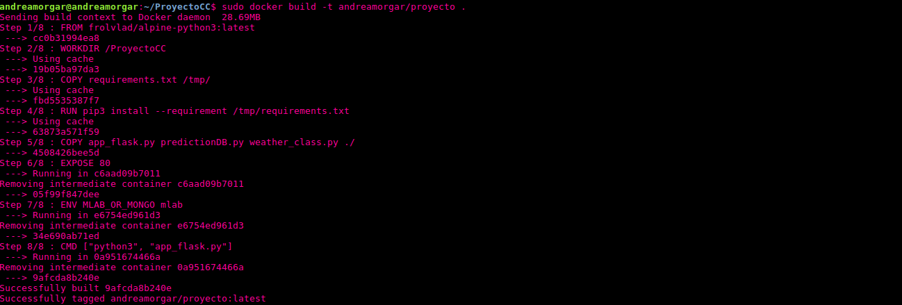

Una vez creada la imagen, podemos crear y ejecutar el contenedor (con dicha imagen) desde local, para comprobar que realmente funciona. Para ello, utilizaremos la orden que se puede ver en la siguiente imagen.

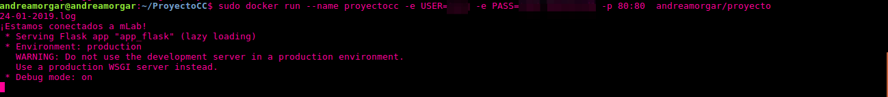

De la imagen justo anterior, hay tres aspectos por destacar:
1. En primer lugar, podemos ver cómo **se ha lanzado el servicio** de forma automática una vez creado el contenedor.

2. En la orden ejecutada, podemos ver que con la opción **-e** se pasan dos variables. Estas variables, son las dos **variables de entorno** que deberan formar parte de la máquina, y las cuáles representan la contraseña y el usuario para conectar con mLab, de forma que no quede visible en el código.

3. Tal y como podemos ver en la [documentación oficial](https://docs.docker.com/install/linux/docker-ce/ubuntu/), como los recursos de red están virtualizados dentro del entorno que definimos, tendremos que **mapear los puertos** utilizados a aquellos desde los que queramos trabajar en nuestra máquina local. Para ello, utilizaremos la opción **-p**. En este caso, accederemos al servicio por el puerto 80 desde nuestro ordenador.

Si ahora nos situamos en el navegador, e intentamos acceder a la ruta raiz, podemos ver en la siguiente imagen que se realiza sin ningún tipo de problema.

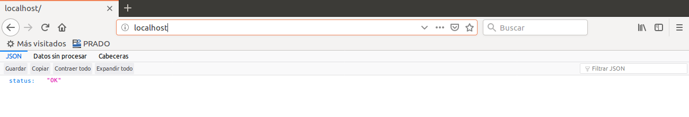

Si intentamos acceder a una ruta, la cuál obtenga información de la base de datos, tal y como podemos ver en la siguiente imagen, también funciona sin problema.

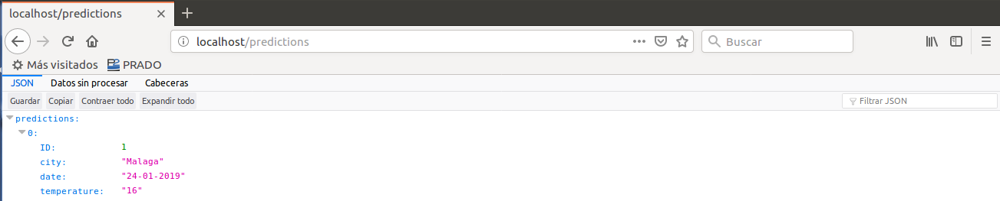

## Despliegue en Azure

### Subir la imagen a Docker Hub
Ya hemos probado que la creación y ejecución del contenedor, con la imagen que hemos definido en el Dockerfile, son correctas. El siguiente paso, es subir esta imagen a un repositorio de Docker Hub, para posteriormente utilizarla para crear un contenedor en **Azure**.

Para ello, debemos hacer **push** a nuestra cuenta de *Docker Hub*, de la forma que aparece en la siguiente imagen.  

Una vez realizado push, podemos acceder a nuestra cuenta y ver, que efectivamente nuestra imagen está disponible. Podemos apreciarlo en la imagen que se muestra a continuación, donde se puede observar el repositorio al cuál hemos hecho push, y que la última actualización fue segundos antes de la captura de pantalla (cuando realizamos push). También podemos ver la forma de descargar la imagen que hemos subido (mediante `docker pull andreamorgar/proyecto`).

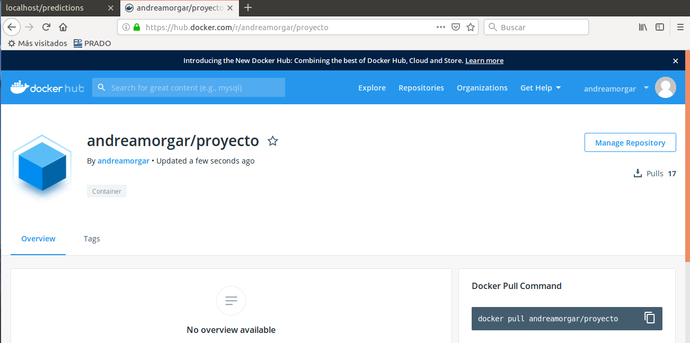

### Contenedor en Azure
Una vez que ya tenemos en el repositorio la imagen que hemos creado anteriormente, tenemos que desplegar el contenedor en Azure. Para ello, podemos utilizar el azure CLI para poder crearlo desde línea de órdenes. Para ello, podemos ejecutar la orden que viene indicada en la [documentación oficial](https://docs.microsoft.com/en-us/cli/azure/container?view=azure-cli-latest ), teniendo en cuenta que debemos especificar algunas cosas en concreto.

- En primer lugar, debemos especificar que queremos que el container se cree con una IP pública (en caso de no indicarlo, por defecto no tendrá ninguna IP asociada). Podemos hacerlo con la opción `--ip-address public`.

- En segundo lugar, debemos indicar que queremos abrir el puerto 80, por el cuál se ejecutará nuestra aplicación. Podemos hacerlo con la opción `--ports`.

- Por último, de alguna forma debemos indicar también las variables de entorno que especificamos a la orden de `docker run` cuando hicimos la prueba en local. Podemos hacerlo con la opción `--environment-variables`. Se puede consultar el uso de esta opción en la [documentación oficial](https://docs.microsoft.com/en-us/azure/container-instances/container-instances-environment-variables).

- Además, recordemos, que debemos indicar un grupo de recursos asociado al container, por lo que, en caso de no estar creado con anterioridad, debemos llevarlo a cabo. Para el grupo de recursos, se intentó utilizar `francecentral`, ya que como vimos, daba buenos resultados con el proyecto. Sin embargo, esta ubicación no está disponible para el despliegue de contenedores, como se puede ver en la siguiente imagen.

  
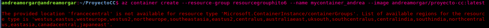

  Por ello, se seleccionó la siguiente con la que obtuvimos buenos resultados: `uksouth` que se encuentre en la lista de ubicaciones disponibles (mostrada en el error que aparece en la imagen anterior). Creamos un grupo de recursos para el contenedor, como se puede ver en la siguiente imagen.

  
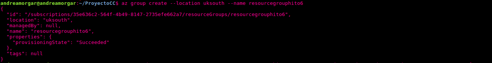

Se puede ver la orden ejecutada para la creación del container en la siguiente imagen.

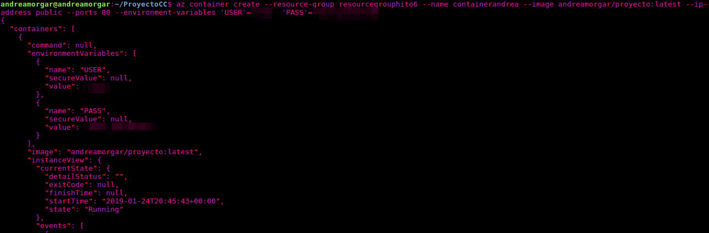

A continuación, desde Azure, podemos ver que se ha creado efectivamente de la manera correcta (con IP asociada, y en el grupo de recursos concreto). Se puede ver el contenedor creado en la siguiente imagen.

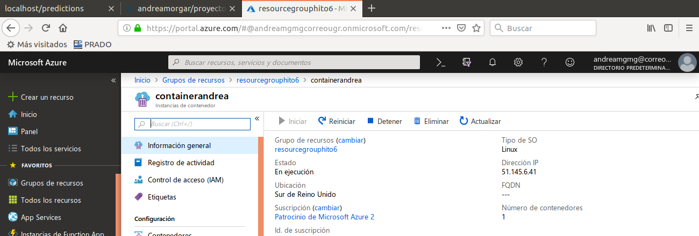

Ahora vamos a acceder, con la IP mostrada en la imagen anterior, a la ruta raiz del servicio, y, tal y como se puede ver en la imagen, se accede al `status:OK`.

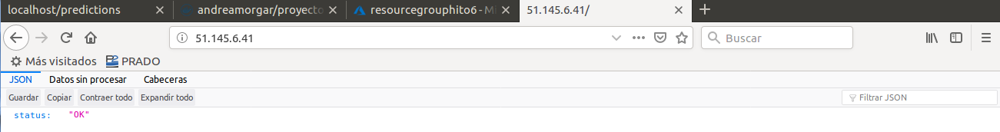

Si de nuevo, intentamos acceder a una ruta que requiera una consulta a la base de datos, podemos ver que, efectivamente, funciona de la forma esperada.

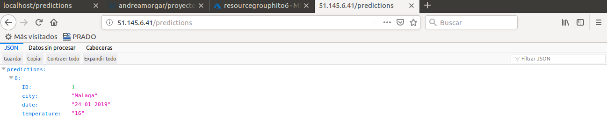

**Como conclusión, el contenedor que hemos desplegado en Azure funciona de la forma esperada.**
