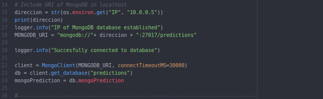

# Proyecto Cloud Computing
## Autora: Andrea Morales Garzón

### Prácticas de la asignatura Cloud Computing del Máster de Ingeniería Informática para el curso 2018/2019

## Proyecto a desarrollar
Estudio de las condiciones meteorológicas en Granada a través de la información facilitada por la Agencia Estatal Española de Meteorología ([AEMET](http://www.aemet.es/es/portada))

**Contenido**
- [Descripción del proyecto](#id1)
- [Arquitectura](#id2)
- [Testeo y pruebas](#id3)
- [Framework y lenguaje a utilizar](#id4)
- [Desplegar el proyecto](#id5)
- [Provisionamiento de máquinas virtuales](#id6)
- [Comprobación del provisionamiento en otra máquina](#id7)
- [Comprobación del provisionamiento de otro compañero](#id8)
- [Avance en el proyecto: MongoDB](#id9)
- [Automatización por línea de órdenes](#id13)
- [Último avance en el proyecto (logs)](#id14)
- [Orquestación de máquinas virtuales](#id15)
- [Comprobación del provisionamiento y orquestación en otra máquina](#id16)
- [Comprobación del provisionamiento y orquestación de otro compañero](#id17)

- [Licencia](#id10)

### Descripción del proyecto  

En este proyecto, se pretende hacer un pequeño análisis de la información actualizada que nos proporciona la [API](https://opendata.aemet.es/centrodedescargas/inicio) de la **Agencia Estatal Española de Meteorología**. De esta forma, se pretende procesar la información de la misma, mostrando aquella más trascendental para los usuarios de Granada en distintas plataformas.

A través de la API de dicha plataforma, se va a acceder a la información más actualizada, y se irá almacenando, de entre dicha información, aquella que en términos generales interesa más a los usuarios.

Se pretende abordar dicho análisis de información en distintos ámbitos. Por una parte, la posibilidad de acceder a la temperatura actual, los centímetros cúbicos registrados, o la temperatura más alta/baja detectada durante ese día. En segundo lugar, proporcionar distintos análisis semanales y mensuales a partir de la información obtenida a partir de los datos actualizados que se van proporcionando a lo largo del tiempo. Este último análisis tiene su interés, ya que las estructuras de datos facilitadas a nivel semanal/mensual son menos específicas en cuanto a la información mostrada diariamente, y puede que haya aspectos de la información diaria de interés para el usuario a nivel semanal o mensual, y que actualmente vea restringido su acceso a dichos datos.

Los usuarios podrán acceder a toda la información que se analice mediante dos formas:
* A través de **Twitter**: se publicarán diversos tweets con la información más importante que se ha ido recabando.
* A través de un bot de **Telegram** también se podrá acceder a la información más relevante.

De esta forma, se pretende facilitar al usuario la consulta de la información más trascendental de una forma sencilla y rápida a través de plataformas utilizadas diariamente por millones de usuarios, como es el caso de las redes sociales mencionadas anteriormente.

### Arquitectura  
Se va a utilizar una arquitectura basada en microservicios en sustitución a una arquitectura monolítica. De este modo podremos realizar y modificar cambios en el software de forma sencilla e independiente, aprovechando las ventajas que nos aporta este tipo de arquitecturas, como pueden ser:
* Versatilidad
* Autonomía: podemos actualizar un microservicio sin que dependa de los demás
* Facilidades de integración
* Aislamiento de errores: un fallo en un microservicio afectará al funcionamiento del mismo, y no tiene por qué afectar a las demás funcionalidades.
* ...

Tendremos así, una colección de distintos microservicios, donde cada uno se encargará de implementar una funcionalidad dentro de la totalidad del proyecto.

Los microservicios que se van a utilizar son los siguientes:.
* Un microservicio que se encargue de **acceder a la API de la AEMET y se encargue de procesar la información obtenida**. La API de la AEMET funciona con distintos ficheros JSON, dependiendo de las características a consultar: datos mensuales, datos de observación actualizados, etc... Se escogeran aquellos que sean de interés para el proyecto, que en principio serán los *datos de observación* y los *valores climatológicos*.

* Un microservicio para **almacenar toda la información a manejar en una base de datos**. Debido a que el lenguaje principal que se va a utilizar va a ser Python, escogeremos una Base de Datos que funcione bien con dicho lenguaje. De entre las diversas [alternativas](https://www.quora.com/What-is-the-best-database-suitable-with-Python-for-web-applications) encontradas, en principio, se utilizará la base de datos NoSQL MongoDB. Se ha decidido esta base de datos por dos razones principales. La primera de ellas, por su facilidad de trabajo con Python (utilizaremos [pymongo](http://api.mongodb.com/python/3.6.0/tutorial.html) para acceder a un cliente de MongoDB y trabajar desde ahí), y en segundo lugar por ser una base de datos con la que ya he trabajado previamente.

* Un microservicio para realizar el **análisis de datos**. En este microservicio, se realizará un análisis de los valores medidos a lo largo del día o la semana que puedan ser de interés. Por ejemplo, como se comentaba anteriormente, poder adquirir valores máximos y mínimos diarios en lo que se lleva de día.

* Quedaría por ver cómo publicar la información. En este caso, estamos hablando de dos microservicios distintos, cada uno encargado de publicar la información a través de una red social diferente. Tendremos un **microservicio que se encargue de publicar tweets**, con información relevante obtenida (a través de [tweepy](http://www.tweepy.org/), y **otro microservicio diferente que consistirá en un bot de telegram** en el cuál podamos también poner a disposición del usuario aquellos datos que puedan ser de mayor importancia (en principio a través de [telebot](https://geekytheory.com/telegram-programando-un-bot-en-python). Se intentarán llevar a cabo ambos microservicios, pero en caso de haber falta de tiempo, se priorizará la publicación de la información a través de Twitter. El tipo de arquitectura utilizado, nos permite esta diferenciación a la hora de publicar la información, ya que podríamos añadir todas las plataformas que quisiésemos para mostrar los datos, sin depender del resto de microservicios que forman el proyecto.

* Por último, existirá un **microservicio LOG**, con el que se comuniquen todos los microservicios anteriores, para informar de las acciones que se están llevando a cabo, almacenarlas y así brindar la posibilidad de poder realizar análisis y monitorizar nuestra aplicación.

Para la comunicación entre los distintos microservicios, se realizará mediante brokers. En este caso, el broker a utilizar será [RabbitMQ](https://www.rabbitmq.com/).

A continuación, en la siguiente imagen, se puede ver un pequeño esquema de los microservicios a utilizar:

De momento, estos son todos los microservicios y comunicaciones que se realizarán. En el futuro, con el avance del proyecto, se irán incorporando los distintos cambios que vayan surgiendo durante la implementación.

#### Testeo y pruebas  
Cada microservicio se testeará de forma individual, antes de desplegarlo en la nube. La realización de los tests se llevará a cabo mediante [TRAVIS](https://travis-ci.org/), y dichos tests se implementarán en Python (ya que es el lenguaje utilizado en el microservicio) con ayuda de la librería [unittest](https://docs.python.org/3/library/unittest.html).

### Framework y lenguaje a utilizar  
Se va a utilizar como lenguaje de programación [Python](https://www.python.org) y [Flask](http://flask.pocoo.org/) como microservicio. Además, el proyecto será desplegado en Azure.

### Desplegar el proyecto  
Despliegue: https://agile-mountain-82339.herokuapp.com/

Se ha realizado un despliegue del servicio web, realizada en el PaaS [Heroku](https://www.heroku.com/). Para ello se han seguido una serie de pasos, que cubren todo el procedimiento que se ha seguido desde el funcionamiento del servicio en _localhost_ hasta su despliegue en Heroku con las comprobaciones correspondientes. También se puede apreciar en ese fichero todas las decisiones tomadas para llevar a cabo el procedimiento.

#### DESPLIEGUE DE SERVICIO WEB EN UN PASS

##### Objetivo y breve resumen del servicio web.

El objetivo principal de este hito era el desarrollo de un pequeño servicio web, y su posterior despliegue en un PaaS. Para ello, se ha desarrollado un pequeño servicio, donde se han implementado la funcionalidad para poder llevar a cabo los cuatro verbos de HTTP: GET, PUT, DELETE y POST.

##### Descripción del servicio desarrollado

SERVICIO REST PARA UNA APLICACIÓN DE PREDICCIONES METEOROLÓGICAS.

**Descripción del servicio**
Vamos a realizar un pequeño servicio rest, donde se podrá acceder e incorporar distinta información meteorológica para distintas localizaciones. De esta forma, podremos acceder a una serie de predicciones tomadas, donde para cada una de ellas tendremos un valor de temperatura y la localización asociada a dicha predicción. También almacenaremos información como puede ser un ID, que nos permita gestionar las consultas a las predicciones, y un valor fecha que indique la fecha en la que se registra dicha predicción.

**RUTAS UTILIZADAS:**
* En primer lugar, tendremos una ruta raíz "/". En esta ruta se mostrará un simple {status : ok} para ver que el servicio funciona correctamente.

* También disponemos de la ruta "/predictions", que nos permitirá:
1. Visualizar (GET) una lista de las predicciones tomadas hasta el momento. Inicialmente esta ruta estará vacía.
~~~
$ curl -i https://agile-mountain-82339.herokuapp.com/predictions
~~~
2. Añadir (PUT) una nueva predicción. A pesar de que se testea el funcionamiento correcto de esta funcionalidad, podríamos desde la terminal introducirlo manualmente, por ejemplo, mediante una orden como la siguiente:
~~~
$ curl -i -H "Content-Type: application/json" -X PUT -d '{"city":"Malaga", "temperature":"16"}' https://agile-mountain-82339.herokuapp.com/predictions
~~~
3. Modificar (POST) una predicción concreta, en función del ID introducido:
~~~
$ curl -i -H "Content-Type: application/json" -X POST -d '{"city":"Malaga", "temperature":"40", "ID":1}' https://agile-mountain-82339.herokuapp.com/predictions
~~~
4. Borrar (DELETE) una predicción concreta introduciendo el ID correspondiente:
~~~
$ curl -i -H "Content-Type: application/json" -X DELETE -d '{"ID":1}' https://agile-mountain-82339.herokuapp.com/predictions
~~~

* Por último, la ruta "/predictions/<id>", que permitirá consultar una predicción en concreto introduciendo su ID.

En todos los casos se devolverá contenido en forma de fichero json.

**Ficheros utilizados**
Para la implementación se han utiizado dos ficheros:

* app_flask.py: contiene la funcionalidad del servicio comentada en la sección anterior.
* weather_class.py: fichero con la especificación de la clase Prediction, la estructura de datos utilizada para los recursos. Su documentación se puede ver también [aquí](https://github.com/andreamorgar/ProyectoCC/blob/master/weather_docs.txt).

**Estructura de datos para el recurso**
En el apartado anterior se ha mencionado que estamos utilizando un fichero que define la estructura de datos de los recursos con los que vamos a trabajar. Se trata de una clase a la que hemos llamado Prediction, la cuál representa una predicción meteorológica de la temperatura en una ciudad. Tiene cuatro atributos básicos.

* Atributo _city_: hace referencia a la ciudad sobre la que se ha tomado la predicción
* Atributo _temperature_: hace referencia a la temperatura existente en la ciudad _city_ en el momento en el que se toma la predicción
* Atributo _date_: hace referencia a la fecha en la que se registra la predicción tomada.
* Atributo _ID_: es el identificador del recurso, que se genera automáticamente al crear el objeto de la clase.

En cuanto a los métodos implementados para la clase, son los básicos para el funcionamiento de la misma
* Métodos que permitan modificar la temperatura (_temperature_) y la ciudad (_city_) de la clase-
* Métodos para acceder a los atributos de la clase
* Método para representar el objeto de la clase.

**Testeo del servicio**
Se utilizan dos ficheros distintos para realizar el testeo, uno para cada fichero:

* test_class.py: fichero para testear el funcionamiento de la clase, con cobertura 100%, tal y como podemos ver:

* test_app_flask.py: fichero para testear el funcionamiento del servicio, con cobertura 100%, tal y como podemos ver:

Tal y como se puede ver en las capturas anteriores, se ha testeado todo la funcionalidad del servicio. Además, se ha hecho especial hincapié en comprobar que el estado, content-type y contenido devuelto por las peticiones realizadas es el correcto. Además, se han realizado también otros testeos adicionales al funcionamiento correcto de lo implementado, como por ejemplo, el hecho de que realizar dos GET a la misma ruta devuelva el mismo resultado, o la consistencia de DELETE cuando pretendamos borrar dos veces el mismo recurso.

Para testear con python, hemos hecho uso de [unittest](https://docs.python.org/3/library/unittest.html), ya que cubre todo lo que necesitamos testear y estaba familiarizada con su funcionamiento, ya que lo he utilizado previamente.

**Anotaciones finales**

Para el desarrollo del servicio se han seguido dos guías principales, que se pueden consultar [aquí](http://flask.pocoo.org/docs/1.0/quickstart/) y [aquí](https://blog.miguelgrinberg.com/post/designing-a-restful-api-with-python-and-flask).

Para ver la cobertura se ha hecho uso del paquete [coverage](https://coverage.readthedocs.io/en/v4.5.x/) de python.
Además, se han excluido algunos aspectos del testeo, como la prueba de un print del contenido de la clase utilizada, y el testeo de la función app.run() de Flask (la que obviamente funciona porque se testean todas sus funcionalidades)

##### Justificación del microframework elegido

La primera elección a la que nos enfrentamos es a la selección de un microframework
con el que trabajar. En mi caso, he elegido [Flask](http://flask.pocoo.org/).

En primer lugar, debemos mencionar que el lenguaje de programación elegido es Python. Haciendo una búsqueda sobre los distintos microframeworks a utilizar, se me planteaban dos posibilidades: elegir Flask, o elegir Django. Finalmente me he decantado por Flask por tres razones principales:
* Asistí al taller "De 0 a Cloud", recomendado por la asignatura, donde se hizo un breve despliegue, y por tanto estaba familiarizada con el microframework.
* Flask está orientado a la simplicidad, mientras que Django ofrece mucha mayor funcionalidad. Para desplegar un pequeño servicio, en realidad no me hacía falta utilizar algo muy complejo, sino al contrario, buscaba hacer las cosas de la manera más sencilla posible.
* No tengo muchos conocimientos respecto a despliegues en la nube, y según consulté en diversas páginas como [esta](https://www.codementor.io/garethdwyer/flask-vs-django-why-flask-might-be-better-4xs7mdf8v), Flask es más adecuado para mi caso, ya es más sencillo de entender su funcionamiento, también a nivel conceptual.

##### Justificación del PaaS elegido

El PaaS que se ha elegido para el despliegue del servicio es Heroku, por las siguientes razones:
* Fue recomendado en clase el primer día de la explicación del Hito 2.
* Es gratuíto para aplicaciones sencillas y de bajo consumo, como es este caso.
* Es fácil de enlazar a Github y a Travis (donde se realizan los tests).
* Asistí al taller "De 0 a Cloud", recomendado por la asignatura, donde se hizo un breve despliegue, y por tanto estaba familiarizada.

##### TRAVIS

Se ha elegido [Travis](https://travis-ci.org/) como plataforma en  la que testear el código.
Las razones para su elección han sido:
* Fue recomendado en clase el primer día de la explicación del Hito 2.
* Estaba familiarizada con su funcionamiento.
* Se puede enlazar fácilmente a Github y a Heroku
* Hay una amplia documentación acerca de como trabajar con Travis y Heroku de forma conjunta.

##### Procedimiento
Por tanto, se ralizará un servicio web en Python con Flask, pasando los test desde Travis y desplegando a Heroku una vez pasados los tests. He documentado el proceso que he seguido para llevar a cabo estas acciones en un pequeño guión con la historia de pasos que he seguido para ello. Se puede ver [aquí](https://github.com/andreamorgar/ejerciciosCC/blob/master/Objetivos/procedimiento_despliegue.md)

A continuación se encuentran enumerados los pasos que he seguido para realizar el despliegue.

**1. Registro en Travis**
El primer paso necesario es disponer de ua cuenta en Travis. Podemos iniciar sesión directamente con nuestro usuario de Github. De esta forma, podremos gestionar el testeo de los repositorios que tengamos en dicha cuenta.

**2. Activar el repositorio de nuestro proyecto en Travis, para poder pasar los tests.**
Simplemente buscamos desde la plataforma Travis el repositorio que queremos testear, y lo seleccionamos.

**3. Crear .travis.yml**
Para poder hacer el testeo del repositorio, necesitamos crear el archivo [.travis.yml](https://github.com/andreamorgar/ProyectoCC/blob/master/.travis.yml) y completarlo con mis especificaciones. Para ello he seguido los pasos de la [documentación](https://docs.travis-ci.com/user/languages/python/). Este fichero, lo ponemos en la ruta raiz de nuestro repositorio.

**4. Tenemos que ver como se despliega en HEROKU**
Para ello, seguimos la [documentación](https://docs.travis-ci.com/user/deployment/heroku/) oficial que encontramos en Travis.

**5. Instalo los clientes.**
 - [Cliente heroku](https://devcenter.heroku.com/articles/heroku-cli)
 - [Cliente travis](https://github.com/travis-ci/travis.rb#installation). En este caso, hay que tener en cuenta que debemos tener instalado [Ruby](https://www.ruby-lang.org/es/) en nuestro ordenador. En mi caso, no lo tenía, por lo que tuve que proceder con la [instalación](http://www.ruby-lang.org/en/downloads/). Para ello, simplemente lo instalamos desde el gestor de paquetes. Además, para un correcto funcionamiento, hay que asegurarse de que la versión utilizada sea superior a la 2.0.

**6.  Instalo Cliente travis**
Una vez tenemos instalado Ruby, podemos proceder con la instalación de Travis. Para ello intentamos la orden que viene en la documentación:
~~~
$ gem install travis -v 1.8.9 --no-rdoc --no-ri
~~~
Sin embargo, no funciona, y siguiendo las correcciones [aquí](https://github.com/travis-ci/travis.rb/issues/391) y [aquí](https://github.com/travis-ci/travis.rb#ubuntu), vemos que hay un problema con las dependencias, y por ello instalo la siguiente versión de Ruby.
~~~
$ sudo apt-get install ruby2.3-dev (porque yo tengo ruby2.3)
~~~

Al repetir la orden correspondiente, podemos continuar la instalación.

**7. Intento realizar encriptación mediante Travis**

Para ello, utilizamos la siguiente orden, tal y como viene indicado en los pasos de la documentación de Travis que estamos siguiendo.
~~~
encrypt $(heroku auth:token) --add deploy.api_key
~~~
Sin embargo, por alguna razón, no consigo que funcione este método, por lo que intento una forma automática de lanzar los test antes del despliegue en heroku. Por tanto, ya no hace falta que introduzca dicha encriptación en .travis.yml, tal y como se indica en la documentación.

**8. Creo el fichero requeriments.txt**
Con este fichero, podremos instalar mediante pip todo lo necesario para que funcione nuestro servicio. Evitando usar la orden "pip freeze", he utilizado el paquete [pipreqs](https://github.com/bndr/pipreqs), que genera el fichero _requeriments.txt_ que se puede ver [aquí](https://github.com/andreamorgar/ProyectoCC/blob/master/requirements.txt). De esta forma instalaremos únicamente lo estrictamente necesario para nuestra versión actual del proyecto.

**9. Fichero Procfile**
Para redactar el contenido de este fichero, sigo las indicaciones de [aquí](https://devcenter.heroku.com/articles/python-gunicorn). Como se está indicando que utilicemos guinicorn, debemos instalarlo propiamente, para un correcto funcionamiento del proyecto. [Guincorn](https://gunicorn.org/) es un servidor HTTP para Python, que es compatible con Flask, lo que me permite su utilización. Este hecho provoca que tenga que volver a actualizar mi fichero _requeriments.txt_, ya que debe añadir esta nueva incorporación.

El contenido del fichero Procfile se puede ver [aquí](https://github.com/andreamorgar/ProyectoCC/blob/master/Procfile). Como se observa, únicamente contiene una línea en la que indicamos el servidor HTTP utilizado y el nombre del fichero en el que se implementa nuestro servicio.

**10. Fichero runtime.txt**
Necesitamos también crear un fichero [runtime.txt](https://github.com/andreamorgar/ProyectoCC/blob/master/runtime.txt), para especificarle a Heroku la versión de Python con la que debe ejecutar los ficheros. En este caso, es importante destacar un error que tuve, ya que Heroku solo es compatible con las versiones de Python 3.6.6. y 3.7.0. En mi caso, yo trabajaba con la versión 3.5.2, lo que impedía que se realizara de forma correcta el despliegue. Viendo las posibilidades de corrección que me proporcionaba Heroku mediante la terminal, simplemente tenía que cambiar la versión en runtime.txt para poder continuar, teniendo en cuenta que después debería comprobar que los tests seguían funcionando a pesar de este cambio en la versión. De esta forma, he podido comprobar, cómo los tests no solo comprobaban que el código estaba correcto, sino que también sirve para asegurar el funcionamiento de mi proyecto en el despliegue.
Esta es la razón por la que runtime.txt contiene la versión 3.6.6 de python.

Se puede acceder a mi fichero runtime.txt desde [aquí](https://github.com/andreamorgar/ProyectoCC/blob/master/runtime.txt). Como se puede observar en el fichero, únicamente contiene la versión de Python con la que vamos a funcionar.

**11. Desplegar en heroku**
Para ello, seguimos los pasos indicados [aquí](https://devcenter.heroku.com/articles/getting-started-with-python#deploy-the-app). Las tres órdenes importantes a realizar son las siguientes:
~~~
heroke create
git push heroku master
~~~
Con dichas órdenes, estamos creando un proyecto de despliegue en Heroku cuando hacemos push del repositorio que queremos desplegar. Es muy útil que te permita ver los [logs](https://devcenter.heroku.com/articles/getting-started-with-python#view-logs), porque te das cuenta de lo que realmente está pasando, de si se ha realizado correctamente el despliegue y, en caso de que no, qué es lo que ha ocurrido. Por ejemplo, a mí me ha servido para poder averiguar problemas que me daba al desplegar, como puede ser que hayas ocupado todas las facilidades de la cuenta gratuita de Heroku.

**12. Conexión con travis, para que nuestro proyecto no se despliegue antes de pasar los tests**
Desde nuestra cuenta en Heroku, nos vamos a la pestaña de Deploy, y seleccionamos la opción de *Enable automatic deploys*, para que con cada push a nuestro repositorio, se pueda desplegar automáticamente en Heroku. Para que los test se realicen previo al despliegue, tenemos que seleccionar la opción de no desplegar hasta que se ejecuten de forma correcta los tests de travis. Todo este proceso lo realizo siguiendo las instrucciones de [aqui](https://medium.com/@felipeluizsoares/automatically-deploy-with-travis-ci-and-heroku-ddba1361647f)

**13. Hacemos heroku login, que nos manda a la web a hacer login**
~~~
$ heroku git:remote -a <nombre proyecto>
~~~

[Aquí](https://devcenter.heroku.com/articles/git) se puede ver más o menos todos los pasos que hemos ido siguiendo a lo largo del proceso.

**14. Otros errores**
Por último faltaría un problema con la distribución en directorios de mis archivos, que impide que se ejecuten mis tests al no estar en la misma ruta que los ficheros a testear.
Este problema lo he solucionado como se indica [aquí](https://stackoverflow.com/questions/1732438/how-do-i-run-all-python-unit-tests-in-a-directory), con la orden:
~~~
python -m unittest discover test/
~~~

Una vez seguidos todos estos pasos, se obtiene un correcto despliegue del servicio REST que hemos realizado.

---
### Provisionamiento de máquina virtuales  

MV: 137.117.174.154

En este documento se detallan los distintos pasos seguidos hasta conseguir provisionar una máquina virtual (primero a nivel local y posteriormente en Azure), con todo lo necesario para poder ejecutar en ella nuestro proyecto. Para ello, se seguirán los siguientes pasos:

1. Uso de *Vagrant* y *Ansible* para provisionar una máquina virtual desde local.

2. Uso de *Ansible* para provisionar una máquina virtual en la plataforma *Azure*.

#### *Vagrant* y *Ansible* para provisionar una máquina virtual desde local.
##### Instalación de las herramientas necesarias

**Instalación de Vagrant**
En primer lugar, vamos a trabajar con máquinas virtuales locales. Para ello, necesitamos instalar una herramienta que nos permita gestionar máquinas virtuales, de forma que podamos arrancarlas, provisionarlas y destruirlas fácilmente.

Por ello, se ha hecho uso de [Vagrant](https://www.vagrantup.com/). Se ha utilizado esta herramienta por dos razones principales:
- Se explicó en el seminario de Ansible impartido en la asignatura, por lo que ya estaba familiarizada.
- Vagrant permite configurar máquinas virtuales de una manera sencilla, además de ser muy fácil de cambiar esa configuración para trabajar con máquinas virtuales en la nube.

El primer paso por tanto, es instalar la herramienta. Para ello, hemos seguido los pasos vistos [aquí](https://howtoprogram.xyz/2016/07/23/install-vagrant-ubuntu-16-04/). Para un correcto funcionamiento de la herramienta, es esencial tener en cuenta dos aspectos:
- Necesitamos una herramienta como VirtualBox, donde podamos gestionar las máquinas virtuales que se están creando y acceder a las mismas.

- Hay que tener cuidado con la versión de Vagrant que instalamos. Si instalamos la herramienta mediante el gestor de paquetes, tal y como se indica en el enlace de descarga anterior, la versión que se descarga por defecto es *Vagrant 1.8.1*. Suponiendo que queremos trabajar con *VirtualBox* (como es mi caso), es importante saber que dicha versión de Vagrant no trabaja con las últimas versiones de *VirtualBox*, por lo que debemos actualizar, como mínimo, a la versión 2.0.2. Para ello, se pueden seguir los pasos vistos [aquí](https://github.com/openebs/openebs/issues/32).

**Instalación de Ansible**
El primer paso es instalar ansible en la máquina con la que estemos trabajando. Para poder disponer de ansible podemos instalarla desde dos formas principales:
- Utilizar el gestor de paquetes *apt-get*, tal y como se puede ver indicado [aquí](https://www.digitalocean.com/community/tutorials/how-to-install-and-configure-ansible-on-ubuntu-16-04).

- Instalar Ansible mediante *pip*. En este caso, vamos a seguir esta segunda forma, ya que como se vio en el seminario de Ansible de la asignatura, el instalar Ansible mediante *pip* tiene sus ventajas. Esto se debe a que te instala, de forma automática, otros modulos necesarios, como por ejemplo para trabajar con YAML (lo necesitaremos más tarde). Podemos ver cómo realizar la instalación [aquí](https://docs.ansible.com/ansible/2.7/installation_guide/intro_installation.html#latest-releases-via-pip).

##### Creación de una máquina virtual con Vagrant

**1. Crear un entorno Vagrant**
Una vez que tenemos Vagrant correctamente instalado, nos situamos en un directorio sobre el que trabajar. En mi caso, todo este proceso lo he realizado desde mi repositorio de ejercicios, por lo que una vez situada en la carpeta correspondiente, ejecutamos lo siguiente.
~~~
$ vagrant init
~~~
Con esta orden, estamos inicializando el directorio actual, de forma que sea un entorno *Vagrant*. Una vez ejecutada dicha orden, se crea un archivo *VagrantFile* en caso de que no exista anteriormente.
Este fichero recién creado, tenemos que modificarlo para adaptarlo a aquello que queramos hacer.

**2. Crear una máquina virtual**
En primer lugar, **especificamos la máquina que queremos crear**. Para ello, podemos buscar [aquí](https://app.vagrantup.com/boxes/search?utf8=%E2%9C%93&sort=downloads&provider=&q=ubuntu) el nombre asociado al sistema operativo que queremos que tenga la máquina virtual que vamos a crear. Este nombre, será el que debemos asociar a "config.vm.box" en el fichero VagrantFile. En mi caso, he especificado que la máquina que quiero crear tenga como sistema operativo *Debian 9*. Las razones de esta decisión son:

- En primer lugar, que cuenta con una versión de Python3 ya instalada, sobre la cuál podemos trabajar directamente.

- En segundo lugar, porque además de lo anterior, se puede ver aquí que estamos trabajando con un sistema operativo proporcionado por la página oficial, y no por algún usuario de la plataforma (razón por la que se prescindió de Ubuntu Server 16.04).

En este punto, el contenido del fichero VagrantFile sería el que se muestra a continuación.

**Contenido del fichero *VagrantFile* hasta el momento:**
~~~
Vagrant.configure("2") do |config|
  config.vm.box = "debian/contrib-stretch64"
  config.vm.hostname = "ubuntuAndrea"

end
~~~

Por tanto, vamos a crear la máquina. Para ello ejecutamos la siguiente orden:
~~~
$ vagrant up
~~~
Una vez finalice la creación de dicha máquina, podemos abrir *VirtualBox*, y comprobar que, efectivamente se ha creado dicha máquina. Lo podemos ver en la siguiente imagen.

Como podemos observar en el fichero de VagrantFile anteriormente mostrado, en este punto aún no hemos realizado ningún provisionamiento con *Ansible*.
Sin embargo, para ver si la máquina virtual que hemos creado a través de *Vagrant* está operativa, podemos hacer un simple **ping**, y de esta forma comprobarlo. En la siguiente figura, podemos ver cómo realmente funciona. En la primera orden ejecutada, podemos ver cómo estamos haciendo ping a todas las máquinas virtuales. En nuestro caso, tenemos únicamente una, por lo tanto la orden ejecutada es equivalente a hacer ping directamente de nuestra máquina. Lo hacemos también, y vemos como efectivamente obtenemos igual resultado.

Además, podemos acceder a la máquina mediante ssh, tal y como se puede ver a continuación. Como podemos observar en la imagen, hemos podido conectarnos de forma correcta mediante SSH. Además, he ejecutado algunas órdenes para poder conocer mejor el estado en el que se encuentra la máquina:
- En primer lugar, podemos comprobar que el sistema operativo de la máquina es el que queríamos, mediante la ejecución del comando **hostnamectl**. Podemos ver también, que se ha creado con el nombre que especificamos en el fichero *VagrantFile*.

- Por otra parte, podemos ver cómo las utilidades que pretendemos instalar con el provisionamiento (como **git** o **pip3**), no están. Esto nos servirá para que, cuando ejecutemos la orden asociada al provisionamiento, veamos cómo realmente hemos hecho un provisionamiento correcto, y están instalados todos los paquetes y librerías que especifiquemos.

---
**Provisionamiento de la máquina virtual**

Vamos a instalar en la máquina virtual todo aquello que necesitemos. Para ello, podemos consultar la guía oficial [aquí](https://docs.ansible.com/ansible/2.7/scenario_guides/guide_vagrant.html), concretamente el apartado *Vagrant Setup*. Aquí se muestra un ejemplo de cómo podemos modificar el fichero VagrantFile para provisionar una única máquina. Para ello, haremos uso de Ansible.

Para poder llevar a cabo el provisionamiento con Ansible, necesitaremos dos ficheros:
- Fichero [ansible.cfg](https://github.com/andreamorgar/ProyectoCC/blob/master/provision/vagrant/ansible.cfg), en el que indicademos dos aspectos principales. En primer lugar, ponemos a False la comprobación de claves del host, para evitar problemas como Man in the Middle, tal y como se explicón en el seminario de Ansible. En segundo lugar, le estamos especificando cuál es el fichero (ansible_hosts) con el que vamos a trabajar y definir las máquinas en cuestión.

- Fichero [ansible_hosts](https://github.com/andreamorgar/ProyectoCC/blob/master/provision/vagrant/ansible_hosts), donde hacemos dos cosas principales. Por una parte, establecemos el puerto (en nuestro caso el 2222) y establecemos la clave SSH con la que vamos a trabajar. En segundo lugar, establecemos la IP y el usuario que tendrá la máquina (en nuestro caso lo hemos llamado *vagrant*).

Por otra parte, en el fichero *VagrantFile*, debemos **indicar el provisionamiento para dicha máquina**. Para ello, le indicamos el fichero *playbook* que queremos ejecutar, el cuál contiene el provisionamiento que queremos que tenga la máquina virtual que hemos especificado anteriormente. Como vemos en el contenido del fichero *VagrantFile* (mostrado a continuación), ya estamos haciendo uso de Ansible para poder llevar a cabo dicha tarea.

**Contenido final del fichero *VagrantFile*:**
~~~
Vagrant.configure("2") do |config|
  config.vm.box = "debian/contrib-stretch64"
  config.vm.hostname = "ubuntuAndrea"

  config.vm.provision "ansible" do |ansible|
    ansible.verbose = "v"
    ansible.playbook = "playbook.yml"
  end
end
~~~

Podemos destacar, del fichero anterior, tres aspectos principales:
- La sección de provisionamiento hace referencia a un playbook de ansible al que en el fichero *VagrantFile* hemos llamado *playbook.yml*.
- Vagrant ejecutará el fichero de provisionamiento  que hemos definido una vez que la máquina virtual arranca y tiene acceso a SSH (o bien cuando ejecutemos explícitamente el provisionamiento).
- El hecho de tener activada la opción verbose va a provocar que se nos muestre más información del comando del Ansible playbook que utilicemos. Todavía no sabemos qué nos mostrará, entonces la voy a dejar de momento, y más adelante ya veremos si se quita del fichero o no.

**Fichero playbook.yml**
Para entender bien el funcionamiento de un playbook de ansible, y sobretodo, qué hace exactamente y de qué forma, podemos consultar el apartado correspondiente en la guía oficial [aquí](https://docs.ansible.com/ansible/2.7/user_guide/playbooks_intro.html). Además, se sugiere consultar este otro [enlace](https://github.com/ansible/ansible-examples), pues contiene una serie de ejemplos y buenas prácticas que se pueden llevar a cabo. De estos dos enlaces, es de donde nos basaremos para llevar a cabo este apartado.

<!-- - Lo primero: python3 [aquí](https://medium.com/@perwagnernielsen/ansible-tutorial-part-2-installing-packages-41d3ab28337d) -->
Para la creación del playbook, y su contenido, me he inspirado en el tutorial al que se puede acceder desde [aquí](https://medium.com/@perwagnernielsen/ansible-tutorial-part-2-installing-packages-41d3ab28337d).

Como ya hemos comentado, para crear la máquina virtual hemos utilizado una máquina Debian con Python 3, que ha sido escogida debido a que de esta forma, no solo contamos con Python instalado en la máquina, sino que por defecto ya trae consigo Python 3, tal y como se puede consultar [aquí](https://linuxconfig.org/how-to-change-default-python-version-on-debian-9-stretch-linux).

En primer lugar, el archivo playbook.yml va a representar únicamente a aquellas cosas genéricas que queramos instalar en una máquina virtual. Por tanto, tendríamos que instalar varios módulos indispensables para nuestro servicio web de la práctica anterior, las cuáles obtendremos a través del gestor de paquetes **apt**:
- **Git**: nos hace falta para poder acceder a nuestro proyecto desde la máquina virtual que hemos creado mediante Vagrant.. Sin git, entre otras cosas, no podremos hacer clone de nuestro repositorio, por lo que es esencial en este caso.

- **python-pip**: para poder hacer uso de pip. Se ha comprobado experimentalmente, que para el funcionamiento correcto de pip3 desde ansible, se debe instalar pip, y posteriormente, indicar el ejecutable concreto de pip con el que queremos funcionar.

- **python3-pip**: para poder utilizar pip3 y descargar aquello que necesitemos para la versión 3 de Python. Es necesario porque voy a instalar los requerimientos para poder ejecutar mi proyecto en la máquina de esa forma. Como estamos trabajando con Python 3, queremos pip 3 concretamente.

- **python-setuptools**: necesario para poder ejecutar el fichero *requirements.txt*. Este paquete fue añadido posteriormente, ya que uno de los errores obtenidos al intentar provisionar la máquina indicaba la necesidad de disponer de este paquete.

- **upgrade pip**: al probar el funcionamiento del playbook en la máquina de Azure, se sugiere que los mensajes de Warning actualizar a la última versión de Pip. Por ello, se ha añadido esta última orden al playbook.

Hasta aquí tendríamos todas las utilidades generales necesarias que deben existir en la máquina virtual de forma que podamos ejecutar nuestra aplicación.

**Siguiendo las buenas prácticas....**

A pesar de que hay múltiples fuentes que defienden que un playbook debe ser un proceso cerrado (como por ejemplo [aquí](https://serverfault.com/questions/750856/how-to-run-multiple-playbooks-in-order-with-ansible)), esta afirmación no es compartida por el estándar de buenas prácticas de Ansible.

Si consultamos la guía de buenas prácticas de Ansible, podemos encontrar una sección llamada *Creating Reusable Playbooks*, a la cuál podemos acceder desde [aquí](https://docs.ansible.com/ansible/latest/user_guide/playbooks_reuse.html). En ella podemos ver, que es preferible reutilizar distintos playbooks, en lugar de empezar con uno de la forma que vimos arriba. Por ello, la parte específica de lo que queremos ejecutar, la vamos a especificar en un segundo playbook, que contendrá todos aquello que sea específico para poder ejecutar y desplegar nuestro proyecto:

- **git clone**: para poder descargar nuestro repositorio en la máquina virtual.

- **Dependencias específicas de la aplicación**: en este caso, aquello que sea imprescindible para el correcto funcionamiento del servicio web.

Por tanto utilizaremos un nuevo fichero, al que hemos llamado *especific_playbook.yml*,
el cuál se encargará de incorporar aquellos aspectos esenciales.

Nos quedaría por resolver cómo llevar a cabo la inclusión del playbook con el contenido específico que queremos incorporar. Para ello, hay múltiples formas, como podemos observar en la documentación oficial disponible [aquí](https://docs.ansible.com/ansible/2.4/playbooks_reuse_includes.html). La principal duda estaría en... ¿qué utilizar? ¿es preferible utilizar *include*  para incorporar otros playbooks al playbook principal?¿O es mejor si utilizamos *import*? Al final, ninguna de las opciones principales de la documentación es la solución, sino que lo preferible, en este momento, es hacer uso de *import_playbook*, pensada para poder ser utilizada en las futuras versiones de ansible. Esta información la podemos obtener si provisionamos la máquina indicando -v en la opción verbose de *VagrantFile*.

Por tanto, el contenido final de nuestro playbook principal quedaría de la siguiente manera. Como se puede observar, este playbook principal, importa al playbook con la configuración específica relativa a mi proyecto, por lo tanto, es suficiente con llamar a este fichero desde *VagrantFile*.

~~~
---
- hosts: all
  become: yes
  gather_facts: False
  tasks:
    - name: Install base packages
      apt:
        name: ['git', 'python-pip', 'python3-pip', 'python-setuptools']
        state: present
      tags:
        - packages

    - name: Upgrade pip
      pip: name=pip state=latest
      tags:
        - packages

- import_playbook: specific_playbook.yml

~~~

**Fichero specific_playbook.yml**

Como se ha indicado anteriormente, en este playbook nos encargaremos del provisionamiento que es específico a la aplicación que queremos desplegar. Por ello, tendrá dos cosas esenciales:

- **Clonación del proyecto**: tenemos que clonar nuestro proyecto en la máquina virtual en cuestión. Esta acción podemos llevarla a cabo sin problemas, ya que como vimos anteriormente, se ha instalado *git*. Podemos especificar el nombre con el que queremos que se nos guarde el repositorio, y además debemos especificar **clone: yes** en la clonación. Los pasos seguidos se pueden ver en la documentación de Ansible [aquí](https://docs.ansible.com/ansible/2.5/modules/git_module.html).

- **Instalación de los paquetes definidos en requirements.txt**. Este paso lo llevaremos a cabo mediante **pip**. Para ello, especificamos que instale en su última versión, el contenido que tenga el fichero *requirements.txt*. Para poder llegar hasta el contenido de este fichero, podemos poner la ruta concreta. En este caso, el usuario que estamos utilizando es *vagrant*, por lo que éste es el que debe estar en la ruta hasta llegar al fichero de requirements. Por último, debemos indicar de que, de los distintos ejecutables de pip que están instalados en el sistema, coja *pip3*.

- **Redirección del puerto 5000 al 80**. Como nuestra aplicación se ejecuta en el puerto 5000, pero para la correción debe ejecutarse en el 80, se ha realizado una redirección de forma que el tráfico del puerto 5000 sea dirigido al puerto 80, y así poder ejecutar nuestra aplicación por dicho puerto. Como vemos, este es un claro caso de la utilidad de usar ficheros específicos, ya que no tendría sentido ejecutar esta orden en un fichero genérico (estamos hablando de un cambio muy concreto referente a la ejecución del proyecto).

Para ver el contenido del fichero *specific_playbook.yml* pincha [aquí](https://github.com/andreamorgar/ProyectoCC/blob/master/provision/vagrant/specific_playbook.yml)

Una vez completado el fichero *VagrantFile*, podemos provisionar la máquina virtual  con la siguiente orden:
~~~
$ vagrant provision
~~~
Ejecutamos dicha orden para provisionar la máquina que previamente hemos creado, y podemos comprobar que efectivamente se ha llevado a cabo el provisionamiento en la siguiente imagen. Como la información que se muestra por la terminal es muy extensa, solo voy a mostrar el resultado final, donde se observa que ha finalizado de forma correcta.

De hecho, si accedemos de nuevo a la máquina mediante SSH, y volvemos a consultar la versión de aquello con lo que hemos provisionado la máquina, podemos ver cómo ahora sí está instalado todo lo necesario. Podemos apreciar este hecho en la siguiente imagen.  Como se observa, ahora sí está **git** instalado, al igual que **pip3**. Si hacemos ls, podemos ver cómo el proyecto se ha clonado en el directorio actual.

Por último mencionar, que de la forma que ha quedado el fichero *VagrantFile*, ya se provisionaría cualquier máquina que se crease mediante la orden:
~~~
$ vagrant up
~~~

**Es decir, se ha configurado el fichero VagrantFile de forma que cualquier máquina que creemos utilizando el mismo, se provisionará con lo que especificado en el fichero *playbook.yml*.**

**Comprobación del provisionamiento.**
Finalmente, nos quedaría por comprobar si finalmente se ha realizado el provisionamiento de manera correcta. Para ello, vamos a acceder al proyecto, el cuál hemos clonado en la máquina virtual, y vamos a comprobar el funcionamiento del servicio.  

En primer lugar, mediante SSH, nos situamos en el repositorio local del proyecto (en la máquina virtual), y encendemos el servicio. Desde otra terminal, volvemos a conectarnos a la máquina virtual mediante SSH y realizamos una petición al mismo. Podemos ver que funciona de manera correcta en la siguiente imagen.

---

## *Ansible* para provisionar una máquina virtual en Azure

### Instalación de las herramientas necesarias
En primer lugar, nos instalamos el cliente de Azure tal y como viene indicado en la documentación oficial, que se puede consultar [aquí](https://docs.microsoft.com/es-es/cli/azure/install-azure-cli?view=azure-cli-latest). Una vez que lo instalemos, ya podremos crear la máquina virtual desde la terminal. El realizarlo desde la terminal simplifica mucho el proceso, además de ser mucho más rápido, ya que podemos directamente especificar todo lo que queremos en nuestra máquina virtual, en lugar de ir recorriendo una gran cantidad de pasos sobre los que al final no se realiza ninguna modificación.

### Creación de la máquina virtual
Para crear una máquina virtual, se han seguido los pasos indicados en la documentación oficial, la cuál se puede consultar [aquí](https://docs.microsoft.com/es-es/azure/virtual-network/quick-create-cli?toc=%2Fazure%2Fvirtual-machines%2Flinux%2Ftoc.json). De forma resumida, hay que ejecutar tres órdenes:
1. Una orden que nos permita conectarnos a nuestra cuenta. Al ejecutar dicha orden, se nos abre el navegador en la página de inicio de sesión de Azure.

2. Una orden para poder crear una máquina virtual. En ella especificamos varios aspectos: el grupo de recursos, el usuario que existirá en dicha máquina, especificar que se utilice clave SSH y por último, la imagen de SO que queremos utilizar. En este caso, se ha cogido Ubuntu Server, ya que era la que inicialmente se pretendía utilizar (ya se ha comentado anteriormente).

3. Una orden para poder hacer uso del puerto 80, tal y como viene indicado en la documentación oficial, que se puede consultar [aquí](https://docs.microsoft.com/en-us/azure/virtual-machines/linux/nsg-quickstart). Además, si recordamos,  la aplicación se programó para ejecutarse inicialmente en el puerto 5000. Si queremos que se ejecute en este puerto, deberíamos ejecutar de nuevo la orden correspondiente, pero esta vez para el puerto 5000.

Para ello, ejecutamos lo siguiente:
~~~
$ az login
$ az vm create --resource-group myResourceGroup --admin-username andreamg --name ubuntuAndrea --image UbuntuLTS --generate-ssh-keys
$ az vm open-port --resource-group myResourceGroup --name ubuntuAndrea --port 80
~~~

Por último, debemos realizar un pequeño cambio, y es que la IP, por defecto, se configura de manera dinámica. Debemos especificar, en la configuración de la máquina en Azure, que queremos que sea estática para que no varíe cada vez que se inicie la máquina.

Con esto, tendríamos ya creada la máquina virtual con las especificaciones anteriores. Podemos ver en la siguiente imagen cómo efectivamente se ha creado dicha máquina.

### Provisionamiento de la máquina virtual

Una vez que tenemos la máquina creada, procedemos a provisionarla. El proceso llevado a cabo para la creación del playbook, es igual al caso de Vagrant, anteriormente documentado, por lo que para mayor detalle, podemos consultar directamente dicha documentación, a la que podemos acceder desde [aquí](https://github.com/andreamorgar/ProyectoCC/blob/master/docs/info_playbook.md).

En realidad, las modificaciones llevadas a cabo para poder provisionar la máquina virtual en Azure se encuentran en el fichero  [ansible_hosts](https://github.com/andreamorgar/ProyectoCC/blob/master/provision/azure/ansible_hosts).

En él, debemos realizar los siguientes cambios:
- Modificar el puerto al 22, para poder hacer uso de SSH.
- Modificar el valor de la variable **ansible_ssh_host** a la IP de nuestra máquina (en mi caso sería 137.117.174.154)
- Modificar el valor de la variable **ansible_ssh_user** al del usuario que hemos creado para la máquina (en mi caso, andreamg).

Tras realizar estos cambios, podemos ejecutar la siguiente orden para provisionar la máquina:
~~~
$ ansible-playbook -i ansible_hosts -b playbook.yml

~~~

Podemos ver, en la siguiente imagen, como algunas de las funcionalidades que no se instalan por defecto en la imagen utilizada, se han instalado. Además, se ha clonado el proyecto desde Github de forma correcta, lo que nos indica que se ha realizado la provisión de manera adecuada.

A continuación, podemos ver cómo efectivamente funciona. Además, si nos fijamos, está funcionando a través del puerto 80, tal y como se requiere en las especificaciones de este hito.

### Comprobación del provisionamiento en otra máquina  

Hecho por @adrianmorente, puede consultarse en [este fichero](./docs/comprobacion_provision.md).

### Comprobación del provisionamiento de otro compañero en mi máquina 
Se ha comprobado que el provisionamiento realizado por @adrianmorente funciona de manera correcta. Puede consultarse [aquí](./docs/comprobacion_otra_provision.md).

---

### Avance en el proyecto: Base de datos
Para el hito 3, se ha avanzado el proyecto añadiendo persistencia a los datos que utiliza el servicio. Para ello, se ha añadido una base de datos con [mLab](https://mlab.com/).

#### Base de datos para el servicio

##### Instalación de las herramientas necesarias
Como avance del proyecto, se ha añadido una base de datos donde guardar las predicciones que se van añadiendo al servicio mediante PUT. Obviamente, también se permitirá el acceso, modificación y borrado de dichas predicciones. Para ello, se ha hecho uso de [mLab](https://mlab.com/), una  *Database-as-a-Service* para *MongoDB* (la herramienta que se decidió utilizar para ello).

Como estamos programando el proyecto en Python, debemos instalar *pymongo* para poder trabajar con mLab. Esto podemos hacerlo ejecutando la siguiente orden.

~~~
$ pip3 install pymongo
~~~

Sin embargo, hay que tener en cuenta un detalle, y es que le hemos añadido una nueva librería a nuestro servicio. Esto implica, que debe ir añadida en *requirements.txt* para que nuestra aplicación pueda pasar los tests y desplegarse de forma correcta. [Aquí](https://github.com/andreamorgar/ProyectoCC/blob/master/requirements.txt) se puede acceder al fichero *requirements.txt* ya actualizado.

##### Funcionalidad añadida

Para poder llevar a cabo el añadido de una base de datos, lo primero es crearse una cuenta en mLab, y crear la base de datos con la que se va a trabajar. Una vez completado estos pasos, podemos pasar a la parte de programación.

Se ha hecho uso de un fichero, al que se le ha denominado [predictionDB.py](https://github.com/andreamorgar/ProyectoCC/blob/master/predictionDB.py), en el cuál se han añadido todas las funciones necesarias para poder utilizar la base de datos que hemos creado. Las funciones creadas, son las siguientes:

- **getDocument(ID)**: devuelve un documento de la base de datos, cuyo ID coincida con el pasado por parámetro. Este documento se corresponde con una predicción concreta con la que puede trabajar nuestro servicio.
- **pushDocument(document)**: añade el documento (predicción) *document* a la base de datos.
- **updateDocument(document,update)**: actualiza el documento (predicción) *document* con la información en *update*.
- **delete_document(document)**: borra de forma permanente el documento (predicción) *document* la base de datos.
- **get_all_predictions()**: devuelve un elemento de tipo cursor con todos los documentos (predicciones) almacenados en la base de datos en ese momento.
- **get_number_documents()**: devuelve el número de predicciones que hay actualmente en la base de datos
- **delete_all_documents()**: borra de forma permanente todos los documentos (predicciones) de la base de datos

Con las funciones anteriores, es suficiente para mantener la funcionalidad que teníamos en el hito anterior, con la diferencia de que ahora existe persistencia en los datos.

##### Modificación del fichero que implementa Flask
Se han modificado las distintas funciones utilizadas en el fichero que implementa el servicio Rest para que éste se comunique con la base de datos, mediante las funciones detalladas en la sección anterior. De esta forma, se ha prescindido de la estructura de tipo vector que almacenaba de forma temporal las predicciones de la base de datos en las ejecuciones del servicio previas al avance. Se puede ver el contenido actual del fichero que implementa el servicio de la aplicación [aquí](https://github.com/andreamorgar/ProyectoCC/blob/master/app_flask.py)

##### Funcionamiento de la base de datos
Podemos ver en la siguiente imagen cómo se vería la base de datos y sus documentos (que como ya hemos mencionado, representan las distintas predicciones). En dicha imagen podemos ver cómo se ha hecho PUT de dos predicciones, las cuáles, (tras refrescar mLab), podemos ver que están en una colección de la base de datos.

Podemos ahora intentar modificar la segunda predicción, mediante POST. Tal y como vemos en la siguiente imagen, el funcionamiento es correcto.

De igual forma podemos ver el funcionamiento para DELETE. Vamos a probar a eliminar la primera predicción. En la imagen siguiente se puede ver cómo la acción es llevada a cabo de forma correcta.

Por último, vamos a imprimir las distintas predicciones que se encuentran en la base de datos, para comprobar que el acceso a la información de la base de datos se lleva a cabo de manera correcta. De nuevo, en la siguiente imagen, podemos ver que se lleva a cabo de manera correcta.

##### Testeo de la nueva funcionalidad
Se ha añadido al directorio *Test*, el fichero [test_database.py](https://github.com/andreamorgar/ProyectoCC/blob/master/test/test_database.py), un test que se encarga de probar el funcionamiento correcto de cada una de las funciones de la base de datos detalladas anteriormente. Este test, se añade a todos los que teníamos anteriormente, a la hora de desplegar el proyecto.

Como se ha dicho, comprueba que la gestión de la base de datos se realiza de forma adecuada. Ello implica, que la inserción, borrado, modificación y acceso a las predicciones se hace correctamente, además de otros aspectos como que el número de documentos en la base de datos sea correcto, que la información insertada sea la correcta y de la forma correcta, etc.

##### Información útil para este avance del proyecto
[Tutorial para usar mongo](https://datawookie.netlify.com/blog/2016/09/python-first-steps-with-mongodb/)

[Tutorial para usar mLab](https://gist.github.com/nikhilkumarsingh/a50def43d8d425b4108c2f76edc1398e)

---

## Automatización de la creación de máquinas virtuales desde línea de órdenes 

### 1. Instalación del CLI de Azure
El primer paso que tenemos que llevar a cabo es instalar el cliente de Azure, para poder trabajar con las máquinas virtuales desde línea de órdenes. La elección de Azure se debe principalmente a dos razones:

  - Ya se utilizó para el hito anterior, también mediante línea de órdenes, por lo que se ha completado y mejorado lo que había anteriormente.

  - Para la gran cantidad de funcionalidad y posibilidades que ofrece, es sencillo de utilizar por línea de comandos, y la documentación es fácil de entender y bastante completa.

  - Se intentó utilizar *Amazon Web Service*, pero sigo esperando el correo con el código. Para el siguiente hito, se intentará cambiar a un sistema cloud diferente.

Para su instalación, podemos seguir los pasos en la documentación oficial, que se puede consultar [aquí](https://docs.microsoft.com/es-es/cli/azure/install-azure-cli?view=azure-cli-latest). En mi caso, como ya utilicé la CLI de Azure en el hito anterior, ya tengo la instalación necesaria en mi sistema, pero bastaría con ejecutar la siguiente orden:
~~~
$ sudo apt-get install azure-cli
~~~

### 2. Creación de una máquina virtual en la nube

Antes de proceder a la creación de una máquina virtual hay varias decisiones que se deben tener en cuenta, a la hora de determinar las características de la máquina que posteriormente provisionaremos para poder desplegar nuestra aplicación en ella. Entre estas decisiones, se encuentran la **elección de la imagen de sistema operativo a utilizar**, o **cuestiones hardware** contempladas para dicha máquina.

#### Escoger la imagen
El primer paso es **escoger la imagen**. Para ello, usamos la siguiente orden, que nos permite ver un listado de las imágenes disponibles.

##### Elección del sistema operativo
En cuanto a la elección del sistema operativo, la aplicación, realmente, podría desplegarse en cualquiera de los sistemas operativos principales. Esto incluye las distribuciones de *Linux, Windows* y *OS X*. Como para nuestra aplicación no nos hace falta utilizar ningún sistema operativo de escritorio, podríamos descartar las dos segundas opciones mencionadas. En base a este argumento, podríamos elegir Linux o incluso un sistema operativo BSD, decisión que se tomará fundamentalmente por preferencia propia del que desarrolle.

En general, el más recomendado para el tipo de aplicaciones que estamos tratando, es Linux, no sólo por popularidad, sino porque también, es el utilizado como referencia en la documentación oficial de las herramientas que estamos usando, véase por ejemplo el caso de Azure [aquí](https://docs.microsoft.com/es-es/azure/app-service/containers/how-to-configure-python). Además, como ya sabemos, para el desarrollo de la aplicación se ha utilizado Python y el usar Linux, nos proporciona otras ventajas, como que viene instalado por defecto, nos permite el uso de variables de entorno y soporta todas las librerías y paquetes de los que pueda depender (algunos paquetes de Python podrían no funcionar para todos los sistemas operativos, como Windows).

En cuanto a la distribución de Linux a utilizar, estos sistemas operativos suelen están construidos para realizar tareas específicas como la administración de redes o desarrollo web. Como se suele usar Ubuntu para fines de desarrollo, (además de ser la más popular) se escogerá esta distribución.
Por otra parte, nuestra aplicación está implementada en la versión 3.5 de Python (aunque se ha testeado que funciona de forma correcta para otras versiones de Python, como Python 3.6), se escogerá una imagen de Ubuntu 16.04 LTS, ya que trae dicha versión de Python por defecto.  Además, es una versión *Long Term Support*, lo cuál es recomendable en vistas a utilizarla para desarrollo.

Para esta decisión, se han seguido algunas recomendaciones mencionadas [aquí](https://www.quora.com/What-is-the-best-OS-for-python-programming), [aquí](https://www.fullstackpython.com/operating-systems.html) y [aquí](https://blog.miguelgrinberg.com/post/the-flask-mega-tutorial-part-xvii-deployment-on-linux).

##### Elección del hardware para la máquina virtual

Sin embargo, la creación de una máquina virtual no solo se limita a la especificación de la imagen a utilizar, sino que además, se debe indicar el hardware del que queremos disponer en dicha máquina virtual.

En la documentación de Azure, hay una [sección](https://docs.microsoft.com/en-us/azure/cloud-services/cloud-services-sizes-specs), dedicada a este aspecto, en la cuál podemos ver que se facilitan distintos tamaños estándar que se pueden elegir a la hora de crear una máquina virtual. De hecho, desde el panel de control podemos consultar los distintos tamaños que existen, en caso de querer modificar alguno de los que ya tenemos. En la siguiente imagen podemos ver algunos tamaños estándar para máquinas virtuales en forma de tabla (que se pueden ver las especificaciones de una manera más clara); en este caso se ha filtrado la vista para que aparezcan los más básicos al principio.

Sin embargo, a la hora de decantarnos por un tamaño u otro, debemos de tener en cuenta que, a pesar de que suelen estar estandarizados, no tienen por qué estar disponibles en todas las regiones (ver [aquí](https://www.danielstechblog.io/azure-vm-sizes/)). Por ello, es preferible realizar un filtrado previo que nos permita saber si el tamaño que queremos elegir está disponible.

Como veremos en la siguiente sección, la región por la que nos hemos decantado en este hito es la del centro de Francia (francecentral), por lo que buscaremos qué tamaños básicos hay en dicha región. Podemos ver la salida de este filtrado en la siguiente imagen. Para obtenerlas, mostramos la lista total de tamaños permitidos para la región en concreto, y filtramos por el nombre de las que hemos podido ver que nos pueden interesar.

Finalmente nos decantamos por el tamaño *Basic_A0*, que como se puede ver en las dos imágenes anteriores, es la que tiene menos prestaciones y aún así sigue siendo más que suficiente para lo que necesita nuestra aplicación. En otras palabras, en este punto del desarrollo, no tiene sentido escoger una máquina con altas prestaciones si estas no van a ser aprovechadas, por lo que elegimos una opción ligera.

#### Escoger la localización
Azure tiene una gran cantidad de regiones globales, manteniendo así la resistencia de sus datos. Se entiende por región a un conjunto de centros de datos, que se encuentran dentro de una zona perimetrada (caracterizada por la latencia). Estos centros de datos, se conectan a través de una red a nivel de región, la cuál es de baja latencia.  En la siguiente imagen, obtenida de la [documentación oficial de Azure](https://azure.microsoft.com/es-es/global-infrastructure/regions/), se puede consultar toda esta información.

A la hora de decantarnos por una localización concreta, tenemos que tener en cuenta aspectos como puede ser la latencia que pueda existir, condicionada a la localización que escojamos. Por ello, vamos a elegir una serie de localizaciones cercanas a la zona geográfica en la que nos encontramos, y realizaremos mediciones para así poder ver qué región es la más adecuada para ubicar la máquina virtual en la que desplegar el servicio.

Para ello, en primer lugar vamos a limitar la elección a Europa (como es de esperar). Teniendo en cuenta tanto la región como la ubicación concreta del centro de datos, vamos a probar las regiones  **Norte de Europa**, **Oeste de Europa**, **Centro de Francia**, **Sur de Francia** y **Oeste de UK**.

Ahora, sólo nos faltaría saber cuál es el nombre asociado a cada una de esas regiones, mediante el cuál se identifican a la hora de utilizarlas directamente mediante **az**. Para ello, podemos hacer uso de la siguiente orden
~~~
$ az account list-locations
~~~

Sin embargo, como es de esperar, de esta forma se nos facilita un listado con todas las regiones disponibles de Azure, y nosotros no buscamos eso, sino simplemente queremos saber aquellas que nos interesan. Para ello, podemos usar la funcionalidad **jq** y filtrar esa lista, de forma que obtengamos únicamente lo que nos interesa. En la siguiente imagen, podemos ver cómo sería la salida obtenida, filtrando por urope (en lugar de Europe, ya que no sabemos si la primera letra estará en mayúscula o en minúscula).

Con la orden anterior, obtenemos información para aquellas localizaciones en cuyo nombre aparece Europe, pero de las que comentamos anteriormente, sólo es el caso de las dos primeras (norte y oeste de Europa). Realizando el mismo filtrado de información para UK y Francia (filtrando por ''*UK*'' y ''*rance* '' en lugar de *France* o *france* por la misma razón ya comentada), podemos obtener toda la información necesaria para poder crear grupos de recursos en estas localizaciones. Podemos ver, que además del nombre asociado a dichas regiones, obtenemos otros datos, como puede ser la localización del centro de datos en función de sus valores de latitud y de longitud.

De esta forma, obtenemos los nombres que debemos utilizar para hacer referencia a dichas regiones.
* **Norte de Europa**: northeurope
* **Oeste de Europa**: westeurope
* **Centro de Francia**: francecentral
* **Sur de Francia**: francesouth
* **Oeste de UK**: ukwest

##### Medición de las latencias
Para poder realizar las mediciones para una localización concreta, debemos seguir los siguientes pasos.
1. En primer lugar deberemos **crear un grupo de recursos** en la región que queramos realizar la medición.

2. Una vez creado el grupo de recursos, tenemos que **crear una máquina virtual especificando como grupo de recursos el recién creado**.

3. Debemos **provisionar la máquina virtual con nuestro servicio**, y arrancarlo, de forma que podamos realizar peticiones al mismo.

4. Utilizar una herramienta que nos permita realizar la medición, lanzando peticiones a nuestro recurso. Para ello se ha hecho uso de la herramienta [Apache Bench](https://httpd.apache.org/docs/2.4/programs/ab.html) (AB).

<u>Apache Bench</u>

<!--
## 3. Realizar peticiones con Apache Bench (AB)

https://blog.diacode.com/testeando-el-rendimiento-de-tu-aplicacion-con-apache-bench

https://kuntalchandra.wordpress.com/2015/10/10/install-apache-bench-ubuntu-14-04/

Para realizar peticiones:
~~~
$ ab -g results.tsv -n 100 -c 20 http://137.117.174.154/
~~~
-->

Es una herramienta sencilla, utilizada para medir el rendimiento de servidores web.
Se ha elegido esta herramienta, por su facilidad y rapidez de uso, ya que podemos usarla de forma rápida y simple para medir la latencia de nuestra aplicación, simplemente con la orden **ab**.

Para realizar una medición, bastaría con ejecutar la siguiente orden, donde *<numero_peticiones>* son el número de peticiones totales que se llevan a cabo, *<numero_peticiones_concurrentes>* es el número de peticiones que se realizan de forma concurrente y <URL> la URL que vamos a testear, que en este caso coincidirá con http://IP/, donde la IP coincidirá con la de la máquina virtual que hemos creado por línea de órdenes. Podemos consultar más información acerca de cómo realizar una petición con Apache Bench [aquí](https://blog.diacode.com/testeando-el-rendimiento-de-tu-aplicacion-con-apache-bench).

~~~
$ ab -n <numero_peticiones> -c <numero_peticiones_concurrentes> <URL>
~~~

Al ejecutar la orden anterior, obtenemos una salida con el formato de la que se puede ver en la imagen que se muestra a continuación. Como se puede ver en esta imagen, se obtiene por una parte, información acerca de la URL a la que se lanzan las peticiones, como puede ser el host, la ruta utilizada, o el puerto mediante el cuál se está accediendo.

Por otra parte, se tiene información acerca de las peticiones en sí, como puede ser: el número de peticiones que no se han llevado a cabo de forma correcta, el número de peticiones completadas , las peticiones por segundo, o los tiempos medios de las distintas peticiones. Una medida que podemos tener en cuenta es el tiempo medio que tardan en realizarse las 20 peticiones concurrentes que se llevan a cabo, lo cual se mide en milisegundos.

A continuación, vamos a utilizar esta herramienta para testear la URL correspondiente a nuestro servicio, en distintas máquinas virtuales, cada una de ellas localizada en una de las regiones contempladas anteriormente.

Para cada una de las regiones, hay que llevar a cabo los siguientes pasos.

1. **Creamos un grupo de recursos localizado en la región** en la que queramos realizar la medición. Para ello usamos la siguiente orden:
~~~
$ az group create --name <nombre-grupo-recurso> --location <region>
~~~

2. **Creamos una máquina virtual**, asociada a dicho grupo de recursos. Para ello, usamos la siguiente orden:
~~~
$ az vm create --resource-group <nombre-grupo-recurso> --admin-username andreamg \
--name <nombre-maquina> --image UbuntuLTS --size Basic_A0 --generate-ssh-keys \
--public-ip-address-allocation static
~~~

  Además, **activamos el puerto 80**, que como sabemos es necesario para poder arrancar el servicio:
  ~~~
  $ az vm open-port --resource-group resourceGroupAndrea --name vmAndrea --port 80
  ~~~

3. **Provisionamos la máquina** de la forma que venimos haciendo desde el hito 3, y arrancamos nuestra aplicación para poder realizar peticiones.

  ~~~
  $ ansible-playbook -i ansible_hosts -b playbook.yml
  ~~~

4. **Realizamos con Apache Bench** la medición de la URL asociada a nuestro servicio.

  Para realizar una medición, bastaría con ejecutar la siguiente orden, donde *<numero_peticiones>* son el número de peticiones totales que se llevan a cabo, *<numero_peticiones_concurrentes>* el número de peticiones que se realizan de forma concurrente y <URL> la URL que vamos a testear, que en este caso coincidirá con http://IP/, donde la IP coincidirá con la de la máquina virtual que hemos creado por línea de órdenes. Podemos consultar más información acerca de cómo realizar una petición con Apache Bench [aquí](https://blog.diacode.com/testeando-el-rendimiento-de-tu-aplicacion-con-apache-bench).

  ~~~
  $ ab -n <numero_peticiones> -c <numero_peticiones_concurrentes> <URL>
  ~~~

  Ejecutamos la orden de *Apache Bench* previamente comentada, especificando un número de peticiones y la concurrencia de las mismas. Para una mayor robusted de los resultados, se ha ejecutado la misma orden en distintos instantes de tiempo, y posteriormente, se ha calculado el resultado medio de dichas peticiones.

Por tanto, repetiremos este procedimiento para todas las regiones que se han contemplado a la hora de tomar esta decisión: **Norte de Europa**, **Oeste de Europa**, **Centro de Francia**, **Sur de Francia** y **Oeste de UK**. A continuación podemos ver los resultados obtenidos de realizar este proceso para las regiones. Como se puede ver, se han realizado tres mediciones por cada una de las regiones, para tener así resultados más robustos.

**Oeste de Europa**

**Norte de Europa**

**Centro de Francia**

**Oeste de UK**

**Sur de Francia**
Como se ha mencionado anteriormente, no se ha podido crear un grupo de recursos para esta localización.

En la siguiente tabla, podemos ver los resultados obtenidos para la medición del tiempo medio de respuesta de las peticiones.  

| Región            | Test 1 (ms) | Test 2 (ms) | Test 3 (ms) | Media (ms) |
|-------------------|-------------|-------------|-------------|------------|
| Norte de Europa   | 124.57      | 117.85      | 121.37      | 121.26     |
| Oeste de Europa   | 104.54      | 105.42      | 106.86      | 105.61     |
| Centro de Francia | 86.591      | 83.551      | 84.58       | 84.91      |
| Oeste de UK       | 124.51      | 105.72      | 136.48      | 122.24     |
| Sur de Francia    | ---         | ---         | ---         | ---        |

Como se puede observar en la tabla, **la región con la que se tiene menor latencia es la del centro de Francia, por lo que será la más adecuada a utilizar en vistas a crear una máquina virtual en la que desplegar nuestra aplicación.**

> *Nota*: Para la región del Sur de Francia no ha sido posible crear un grupo de recursos, puesto que no muestra disponibilidad para ello. Por tanto, no se ha podido utilizar para hacer las pruebas, ni se podrá utilizar para la máquina virtual definitiva que utilicemos.

<!--Para conocer la IP, que tiene que ir en el script de ansible:
https://github.com/Azure/azure-cli/issues/2677-->

### 3. Script de creación de máquinas virtuales y aprovisionamiento

Por último, una vez que ya hemos decidido la región y la imagen que queremos utilizar, faltaría automatizar todo el proceso en un script, al que hemos llamado [acopio.sh](https://github.com/andreamorgar/ProyectoCC/blob/master/acopio.sh). En este script, se llevará a cabo tanto la creación del grupo de recursos y máquina virtual, como el aprovisionamiento de todo aquello necesario para poder arrancar nuestro servicio en la máquina que se ha creado.

Por tanto, en el script se llevarán a cabo los siguientes pasos:

1. **Creación del grupo de recursos a utilizar**, asignando como localización la que se decidió en el apartado anterior (Centro de Francia). Para ello, podemos utilizar la siguiente orden:
~~~
$ az group create --name <nombre-grupo-recursos> --location francecentral
~~~

2. **Crear la máquina virtual con ese grupo de recursos**, con un usuario y con acceso a ssh, de la misma forma que se ha explicado a lo largo del documento. Además, se establecerá la IP estática por defecto (ya que se establecerá de forma dinámica cada vez que encendamos la máquina si no lo especificamos).
~~~
$ az vm create --resource-group <nombre-grupo-recursos> --admin-username <usuario> --name <nombre-maquina> --image <imagen> --size Basic_A0 --generate-ssh-keys --public-ip-address-allocation static
~~~

3. Como ya sabemos, debemos **abrir el puerto 80 para poder ejecutar nuestra aplicación en dicho puerto**, ya que esta acción no se lleva a cabo por defecto.
~~~
$ az vm open-port --resource-group <nombre-grupo-recursos> --name <nombre-maquina> --port 80
~~~

4. Por último, faltaría **provisionar la máquina que recién hemos creado.** Como ya vimos en el hito anterior, para ello, debemos indicar el host sobre el cuál queremos provisionar. Por tanto, antes de nada, tenemos que obtener de alguna forma la IP de la máquina que se ha creado en los pasos anteriores. Para ello, hay varias formas:

    - Filtrar la salida de la creación de la máquina virtual, la cuál facilita en un parámetro la IP pública asignada a dicha máquina.

    - Obtener la IP de la máquina del listado de todas las máquinas virtuales que tenemos en nuestra cuenta.

    - **Obtener la IP de los detalles de la máquina que acabamos de crear**. Esta última forma, ha sido la finalmente escogida, por las facilidades que proporciona, ya que:

      - <u> Permite obtener la IP de la máquina siempre y de manera persistente</u>, sin necesidad de mostrar todas las máquinas del usuario (que pueden ser muchas, y es una orden que tarda en ejecutarse).

      - <u> No obliga a tener que crear la máquina para poder leer el valor de IP</u> (que puede estar bien si se acierta a la primera y no se quiere manipular nada más en el script, porque en cualquier otro caso tendríamos que estar creando y eliminando máquinas virtuales para poder manipular la variable que estamos asignando).

  Estos detalles de la máquina, se pueden obtener mediante la ejecución de la siguiente orden, donde, como podemos ver, se debe especificar tanto el nombre de la máquina como el del grupo de recursos que se ha asignado a dicha máquina.

  ~~~
  $ az vm show -d --resource-group <nombre-grupo-recursos> --name <nombre-maquina>
  ~~~

  Sin embargo, la salida que se genera con dicha orden no contiene únicamente la IP, sino muchos más aspectos como puede ser el nombre de la máquina, MAC, información del administración, información de las claves SSH, información acerca del grupo de recursos, etc. A nosotros, concretamente, únicamente nos hace falta conocer el valor de la dirección IP pública que se ha asignado a dicha máquina, por lo que debemos filtrar esa búsqueda.

  Como se vio en el Seminario de Azure impartido en la asignatura, podemos realizar este tipo de filtros con la herramienta **jq**. Como el parámetro que estamos buscando tiene el nombre *publicIps*, podemos realizar filtrar toda la salida de la orden anterior, quedándonos únicamente con el valor asociado a dicha variable. A continuación se muestra la orden necesaria para realizar dicha acción.
  ~~~
  $ az vm show -d --resource-group <nombre-grupo-recursos> --name <nombre-maquina> | jq -r '.publicIps'
  ~~~
  Almacenando este valor en una variable del script, tendríamos ya el valor correspondiente a la IP pública de nuestra máquina.

5. Por último, faltaría **añadir al script la línea que se corresponde con la ejecución del playbook**, al cuál hay que asignarle de alguna forma la IP que acabamos de obtener.

  En un principio, se intentó utilizar variables con ansible, de forma que pudiésemos especificar, desde fuera de *ansible_hosts*, el valor que debe tomar el host (en otras palabras, asignar como variable el valor de la IP). Sin embargo, la [documentación de Ansible acerca del uso de variables](https://docs.ansible.com/ansible/2.4/playbooks_variables.html#passing-variables-on-the-command-line) no es muy extensa, y no terminé de entender cómo llevarlo a cabo de esta manera.

  <u> **Solución**</u>: se siguió la forma que se puede ver [aquí](https://stackoverflow.com/questions/44592141/ansible-ad-hoc-command-with-direct-host-specified-no-hosts-matched), donde se propone pasar la IP como valor al parámetro *inventory*, que se asigna con la opción **-i** del comando **ansible-playbook**.  Sin embargo, de esta forma, aún no se consigue hacer funcionar el provisionamiento, ya que ansible no es capaz de establecer conexión mediante SSH de manera correcta, no pudiendo completar el provisionamiento. Tal y como viene resuelto [aquí](https://github.com/ansible/ansible/issues/19584), podemos ver que el problema es que no estamos indicando de ninguna de las maneras el usuario remoto con el cuál llevar a cabo el procedimiento.

  Almacenando la IP en una variable llamada *mv_ip*, la orden quedaría como se puede ver a continuación:
  ~~~
  $ ansible-playbook -i "$mv_ip," -b playbook.yml --user <usuario>
  ~~~

  Por último, tal y como se puede ver en la fotografía, se lleva a cabo el provisionamiento, y de manera seguida, se puede arrancar la aplicación, utilizando la IP que es mostrada por el script [acopio.sh](https://github.com/andreamorgar/ProyectoCC/blob/master/acopio.sh). Debido a la gran cantidad de información que muestra la ejecución del script (se muestra mucha información acerca de la máquina virtual creada), solamente se mostrará el final de dicho procedimiento, donde se puede apreciar cómo se detecta la IP(40.89.191.234) y el provisionamiento para dicho host.

  

  Si ahora accedemos por SSH a dicha IP y arrancamos la aplicación, podemos ver cómo funciona de la forma correcta.
  

## Último avance en el proyecto 

### Sistema de Logs
Para este hito, vamos a realizar un avance en el proyecto, que consiste en añadir la utilidad de logs a nuestra aplicación.

Los logs son uno los aspectos más importantes en las arquitecturas software. De hecho, tal y como hemos visto en la asignatura, existen arquitecturas totalmente orientadas al trabajo con logs, y ya es algo indispensable en las arquitecturas modernas.

Para poder añadir la gestión de logs a este proyecto, vamos a utilizar la librería **logging** de Python, que nos permitirá poder gestionar los distintos mensajes que se deban enviar en nuestra aplicación. Principalmente queremos manejar mensajes de logs para dos aspectos diferentes:

1. En primer lugar, **todos aquellos que provienen de nuestra aplicación** realizada con Flask. Aquí tendremos en cuenta tanto el arranque de la aplicación, las distintas peticiones que se llevan a cabo, y todos los mensajes de Logs generados por la aplicación en sí.

2. Por otra parte, **se utilizarán mensajes de logs para indicar los distintos accesos y peticiones a la base de datos que está conectada a nuestra aplicación**.

#### Implementación

Para poder implementar esta funcionalidad, lo primero es importar la librería **logging** a los ficheros con los que estamos trabajando.Una vez importado, ya podemos comenzar a manejar los logs de nuestra aplicación, y también a generar aquellos que consideremos necesarios.

Para ello, hay que destacar los siguientes aspectos:

- Podemos modificar el formato de los mensajes de logs a nuestro gusto. En mi caso, he considerado mostrar, en cada mensaje de logs, la hora, el origen del mensaje de log, el propio mensaje en sí y el tipo de mensaje (que puede ser *DEBUG, INFO, WARNING, ERROR* o *CRITICAL*). Esta información se especifica en una función llamada *basicConfig(...)* de la librería ya mencionada.

- Además, para guardar toda la información en un fichero, podemos especificarlo también, con la opción "a" que hace referencia a **append**, de forma que siempre estemos añadiendo información al fichero y nunca sobreescribamos el contenido del mismo. Este aspecto también se especifica en la función  *basicConfig(...)* previamente mencionada.

- Por otra parte, tenemos que especificar de alguna manera el origen o nombre de donde proviene el mensaje de log, ya que nos permitirá identificar su procedencia. Para ello, podemos utilizar una función llamada *getLogger(<nombre>)*, en la cual indicaremos el nombre con el que queremos identificar la procedencia de ese log. Posteriormente, podremos generar mensajes de logs, asociados a dicho identificador.

- En cuanto al fichero en el que se almacenan todos los mensajes de logs, hay que mencionar que no hay uno solo, sino que se generará un fichero distinto por cada día en el que se generen nuevos mensajes de logs. De esta forma, podemos gestionar la memoria asociada a los ficheros que almacenan mensajes de logs de una manera rápida y sencilla  (y de camino, organizar los mensajes que se generen).

En la siguiente imagen, podemos ver el código necesario para llevar a cabo los puntos comentados. Podemos ver, en ella, una pequeña fracción de código correspondiente a la implementación de toda la funcionalidad anterior, en este caso, para el caso de la base de datos.

#### Visualización de los mensajes de logs generados

A continuación podemos ver un ejemplo de cómo podría verse el contenido del fichero de logs para un día concreto en el cuál arrancamos la aplicación.

---

#### Material interesante para la realización de este avance

- [Documentación oficial para gestionar logs en Python](https://docs.python.org/3.1/library/logging.html#configuring-logging)

- [Tutorial de iniciación a *Logging*](https://realpython.com/python-logging/).

<!--Podríamos guardar los logs en una nueva colección de la base de datos, como viene indicado [aquí](https://stackoverflow.com/questions/8103864/logging-to-mongodb-from-python)-->

---

### Orquestación de máquinas virtuales 

En este hito, vamos a realizar la orquestación de dos máquinas virtuales en Azure, donde una de las máquinas alojará la base de datos, y la otra, el servicio REST que estamos desarrollando (el cuál hace uso de dicha base de datos, ya que es de donde adquiere la información). Para ello, haremos uso de [Vagrant](https://www.vagrantup.com/), una herramienta para la creación y configuración de entornos de desarrollo.

En esta documentación veremos varias cuestiones principales:
1.  Cómo empezar a trabajar desde Vagrant con Azure

2. Cómo podemos crear, desde VagrantFile, dos máquinas virtuales en Azure con la misma red interna, de forma que podamos realizar una conexión entre ellas a nivel de red interna.

3. Provisionar una máquina virtual con MongoDB, de forma que escuche las peticiones de la otra máquina orquestada (avance realizado debido a que es necesario para realizar la orquestación que llevaremos a cabo entre las dos máquinas).

#### Primeros pasos con Vagrant

En primer lugar, tenemos que empezar por la instalación de Vagrant en nuestro ordenador, de forma que podamos utilizar dicha herramienta , y así poder trabajar directamente con el Vagrantfile y la especificación concreta de las máquinas que queramos utilizar.

Sin embargo, como ya utilicé Vagrant en el **Hito 3** para realizar el provisionamiento de máquinas virtuales en local, los pasos para empezar a trabajar con Vagrant desde local se pueden consultar en [la documentación del hito mencionado](https://github.com/andreamorgar/ProyectoCC/blob/master/provision/README.md). **En este documento, se puede ver detalladamente cómo hacer la instalación de Vagrant, y la creación y provisionamiento de una máquina virtual en local (mediante VirtualBox).**

#### Vagrant con Azure

Como ya se ha comentado en la introducción de la documentación, se pretende usar Vagrant para crear dos máquinas virtuales en Azure:

- La primera máquina, a la que nos referiremos como `maquinaservicio`, **se encargará de alojar el servicio REST**. Por tanto, la provisión de esta máquina se corresponderá, con la que hemos llevado a cabo hasta ahora, ya que necesitaremos que la máquina disponga de todos los paquetes necesarios para poder ejecutar el proyecto (como puede ser el caso de *Flask*, o *Python3* en el caso de que no estuviera instalado por defecto).

- La segunda máquina, a la que nos referiremos como `maquinamongo`  será la que tenga alojado un servicio de MongoDB. De esta forma, cada vez que se realice al servicio REST una petición  que necesite información almacenada a la base de datos, se accederá a la información que contiene la base de de datos de `maquinamongo`.

Para llevar a cabo todo el desarrollo necesario, se ha realizado desde el directorio [`ProyectoCC/orquestacion`](https://github.com/andreamorgar/ProyectoCC/tree/master/orquestacion) del repositorio del proyecto. En este directorio, ejecutamos la siguiente orden para poder crear el fichero Vagrantfile y comenzar a trabajar con *Vagrant*.
~~~
$ vagrant init
~~~

##### <u>Configuración para una máquina en Azure<u/>
Tras ejecutar la orden anterior en el directorio en el que queramos trabajar con Vagrant, se nos creará el fichero *Vagrantfile*. Al realizar dicha orden, se nos crea un contenido por defecto, pero en este caso, lo borraremos y lo sustituiremos por uno apropiado para poder trabajar con Azure.

Lo primero es descargar el plugin de Azure, y así poder configurar todo para poder trabajar con Vagrant en Azure. Siguiendo los pasos vistos en [el Github de Azure](https://github.com/Azure/vagrant-azure), podemos obtener este plugin con las siguientes órdenes:

~~~
$ vagrant box add azure https://github.com/azure/vagrant-azure/raw/v2.0/dummy.box --provider azure
$ vagrant plugin install vagrant-azure
~~~

A continuación, creamos el fichero Vagrantfile tal y como viene especificado  

Para empezar, vamos a configurar un Vagrantfile partiendo del básico que se nos facilita en la [documentación oficial](https://github.com/Azure/vagrant-azure), añadiendole una configuración adicional de forma que podamos crear una máquina virtual de acuerdo a lo que necesitemos. De esta forma podremos crear una máquina virtual que cumpla con las mismas especificaciones que las máquinas de Azure que creamos con el CLI de Azure en el hito anterior. El resultado, sería el que se muestra a continuación.

~~~
require 'vagrant-azure'
Vagrant.configure('2') do |config|
  config.vm.box = 'azure'

  # Usamos una clave ssh local para conectar al box de vagrant remoto
  config.ssh.private_key_path = '~/.ssh/id_rsa'
  config.vm.provider :azure do |az|

    # Cada uno de los valores siguientes se deben declarar en variables de entorno con el nombre que se especifica.
    az.tenant_id = ENV['AZURE_TENANT_ID']
    az.client_id = ENV['AZURE_CLIENT_ID']
    az.client_secret = ENV['AZURE_CLIENT_SECRET']
    az.subscription_id = ENV['AZURE_SUBSCRIPTION_ID']

    az.vm_image_urn = 'Canonical:UbuntuServer:16.04-LTS:latest'
    az.vm_name = 'maquinaservicio'
    az.vm_size = 'Basic_A0'
    az.resource_group_name = 'resourcegrouphito5'
    az.location = 'francecentral'
    az.tcp_endpoints = 80
  end
end
~~~

Respecto al contenido del Vagrantfile anterior, debemos destacar algunas cuestiones, que se mencionarán posteriormente:
- El uso de **variables de entorno** que deberán estar declaradas en nuestra máquina.
- **Otros parámetros (adicionales) para personalizar la máquina virtual** a las necesidades del proyecto
- Especificación del **provider de Azure**

###### Uso de variables de entorno

Nos podemos ver con un "problema" inicial, y es que se están haciendo uso de variables de entorno que no tenemos declaradas en nuestro sistema para asignar el valor de los campos obligatorios que deberemos especificar para Azure. Por tanto, previamente, nosotros debemos exportar como variables de entorno esos valores, porque sino no se van a detectar. Como podemos ver en este [otro tutorial secundario](https://blog.scottlowe.org/2017/12/11/using-vagrant-with-azure/), en concreto, deberemos especificar el valor de los siguientes parámetros, relacionados con los ID de Tenant (*inquilino*), cliente y subscripción de Azure: `az.tenant_id`, `az.client_id`, `az.client_secret ` y  `az.subscription_id `.

Los tres primeros parámetros (*tenant_id*, *client_id*, *client_secret*), podemos obtenerlos de la salida que nos proporciona la siguiente orden:
~~~
$ az ad sp create-for-rbac
~~~

Respecto al último de los parámetros, el cuál se corresponde con el ID de la suscripción en Azure, podemos obtenerlo ejecutando la siguiente orden con el cliente de Azure por línea de órdenes:
~~~
$ az account list --query '[?isDefault].id' -o tsv
~~~

Una vez tenemos los valores correspondientes, nos basta con crearnos variables de entorno con el mismo nombre de las utilizadas en el VagrantFile anterior de la siguiente forma:
~~~
$ export AZURE_TENANT_ID=xxxxxxx-xxxx-xxxx-xxxx-xxxxxxxxxxxx
$ export AZURE_CLIENT_ID=xxxxxxx-xxxx-xxxx-xxxx-xxxxxxxxxxxx
$ export AZURE_CLIENT_SECRET=xxxxxxx-xxxx-xxxx-xxxx-xxxxxxxxxxxx
$ export AZURE_SUBSCRIPTION_ID=xxxxxxx-xxxx-xxxx-xxxx-xxxxxxxxxxxx
~~~

###### Otros parámetros adicionales en Vagrantfile
Además, le podemos añadir una serie de líneas que nos permitan especificar aspectos concretos de la máquina virtual que queremos crear, como puede ser el nombre de la máquina, el grupo de recursos asociado, o la región a utilizar. Concretamente, especificaremos todos los parámetros con los que hemos ido trabajando hasta ahora:
- Imagen de Ubuntu Server con la versión 16.04.5 (LTS) (con `vm_image_urn` ).
- Grupo de recursos en la región **Francia Central**, ya que como vimos en el hito anterior, fue con la que obtuvimos mejores resultados (con `location`).
- Tamaño de la máquina virtual **Basic_AO** (con `vm_size`).
- Abrimos el **puerto 80**, que es desde el que ejecutamos la aplicación (con `tcp_endpoints`).

Con estos añadidos, se crearía una máquina con las mismas características que la del hito anterior.

###### Uso del provider de Azure

Para especificar que estamos trabajando con Azure podemos hacerlo de dos formas diferentes:

1. Indicándolo por línea de órdenes al hacer `vagrant up`, de la siguiente forma:
~~~
$ vagrant up --provider=azure
~~~

2. Indicándolo al inicio del fichero Vagrantfile, con `require`, y el plugin del proveedor de Azure que nos descargamos previamente de la siguiente forma: `require 'vagrant-azure'`.

En este caso, me he decantado por la segunda opción y se ha definido dentro del Vagrantfile. Esto se debe a que, tal y como se comentó en clase, de esta manera podremos hacer `require` de todo lo que necesitemos, y hacer así la orquestación dentro del fichero Vagrant de todas las máquinas virtuales que queramos.

##### <u>Orquestación de máquinas virtuales<u/>
Una vez sabemos lo básico de cómo crear desde Vagrant una máquina en Azure, deberemos realizar el proceso para crear dos máquinas, el cuál es el que se ha definido en el Vagrantfile. Para ello, partiendo del Vagrantfile de ejemplo que he mostrado en la sección anterior, se han definido dos máquinas virtuales, cada una con su nombre y sus especificaciones necesarias. Como ayuda para la creación de más de una máquina, se ha consultado [este enlace](https://www.rubydoc.info/gems/vagrant-azure/1.3.0) comentado en clase.

**Desde [este enlace](https://github.com/andreamorgar/ProyectoCC/blob/master/orquestacion/Vagrantfile) podemos acceder al contenido del Vagrantfile resultante**. De dicho fichero, los aspectos más relevantes y que se deben destacar para cada una de las máquinas especificadas en el Vagrantfile  son los siguientes:

- Ambas máquinas pertenecen al **mismo grupo de recursos**. Para ello hemos utilizado el parámetro `resource_group_name`. Para indicar la localización del grupo de recursos se hace uso de `location`. Se ha especificado la misma localización que se utilizó para el hito anterior, ya que se hicieron las distintas comprobaciones que nos permitieron dar con la más adecuada para el proyecto. Para mayor detalle, se puede consultar en el apartado 2 de [la documentación del Hito 4](https://github.com/andreamorgar/ProyectoCC/blob/master/docs/automatizacion.md).  

- Cada una de las máquinas tendrá un nombre asignado, mediante `vm_name`. Además, cada una tendrá especificado la imagen y tamaño de la máquina con `vm_image_urn` y `vm_size` respectivamente. Para determinar la imagen y tamaño escogidos, se han seguido los mismos criterios ya justificados en el hito anterior, a los cuáles se puede acceder en el apartado número dos de [la documentación del Hito 4](https://github.com/andreamorgar/ProyectoCC/blob/master/docs/automatizacion.md).  

- Para cada una de las máquinas, **se ha realizado su provisionamiento** con el playbook correspondiente. En el caso de la máquina `maquinaservicio`, se realizará el aprovisionamiento como lo hemos realizado hasta ahora, y en el caso de la máquina `maquinamongo`, utilizaremos un nuevo playbook que se encarga de provisionar la máquina virtual con mongo, además de configurar y reiniciar el servicio. Podemos realizarlo indicando `provision` y el playbook asociado, como veremos en secciones posteriores de este documento.

- **Se han abierto los puertos correspondientes** para que se pueda ejecutar la aplicación. Para ello, haremos uso del atributo `tcp_endpoints`.
  - El puerto 80 para acceder al servicio REST
  - El puerto 27017 que el que utiliza *MongoDB* por defecto.

- **Se ha definido una red interna** llamada `andreanetwork` que permitirá poder comunicar las máquinas mediante la red interna. De esta forma, la primera máquina en crearse (en este caso `maquinaservicio`, se le asignará la IP **10.0.0.4**, y a la segunda máquina (`maquinamongo`) le corresponderá la dirección **10.0.0.5**). Para ello, hemos utilizado el parámetro `virtual_network_name`.

**De esta forma, tan solo con ejecutar la orden `vagrant up --no-parallel`, podremos crear y provisionar dos máquinas en azure, con los requisitos  y configuración necesaria para el proyecto**. Es necesario añadir la opción mencionada (`--no-parallel`), ya que de otra forma, al intentar crear las máquinas en paralelo, al estar usando el mismo grupo de recursos, se producen errores relacionados con la asignación de direcciones. De hecho, si se consulta la [documentación oficial](https://www.vagrantup.com/docs/cli/up.html), podemos ver que esta opción debe ser utilizada siempre y cuando el provider en cuestión no permita la creación paralela de las máquinas virtuales, como resulta ser el caso en cuestión.

##### <u>Aprovisionamiento de las máquinas virtuales<u/>
Por último, para finalizar con la documentación del fichero [Vagrantfile](https://github.com/andreamorgar/ProyectoCC/blob/master/orquestacion/Vagrantfile), faltaría ver la provisión de las máquinas que se realiza directamente desde Vagrant, después de la creación de cada una de las máquinas.

###### Aprovisionamiento de la máquina que aloja el servicio rest

###### Copiar ficheros en la máquina virtual desde Vagrant
En primer lugar, mencionar que, tal y como se recomendó en clase, uno de los cambios realizados en este hito consiste en copiar en la máquina únicamente aquellos ficheros que hagan falta para ejecutar la aplicación (y no todo el contenido que tenemos en el repositorio de Github, como pueden ser los ficheros de documentación o las imágenes utilizadas en dichas documentaciones).
Esto podemos llevarlo a cabo con `file`, tal y como podemos ver en la [documentación oficial](https://www.vagrantup.com/docs/provisioning/file.html).

En nuestro caso, pondremos en el fichero Ansiblefile la siguiente línea (siendo <fichero> el fichero en cuestión que queremos copiar en la máquina):
~~~
maquina1.vm.provision "file", source: "../<fichero>", destination: "/home/vagrant/ProyectoCC/<fichero>"
~~~

Concretamente, indicamos `maquina1` porque es la máquina que queremos provisionar con dichos ficheros (en este caso concreto).

###### Provisionamiento con el playbook.yml
Para terminar el provisionamiento desde Vagrant, una vez que se ha creado la máquina virtual `maquina1` (la cual alojará el servicio REST) realizamos lo siguiente, siendo [playbook.yml](https://github.com/andreamorgar/ProyectoCC/blob/master/orquestacion/playbook.yml) el playbook que provisiona el servicio REST.

~~~
maquina1.vm.provision "ansible" do |ansible|
  ansible.playbook = "playbook.yml"
end
~~~

Este [playbook.yml](https://github.com/andreamorgar/ProyectoCC/blob/master/orquestacion/playbook.yml), previamente mencionado, está basado en el realizado para el Hito 3, excepto por dos modificaciones:
1. Ya proporcionamos, en el Vagrantfile, los ficheros necesarios para ejecutar el proyecto con `file`, por lo que no necesitamos ni instalar git ni por tanto, clonar el repositorio en cuestión.

2. Por problemas, al parecer, de sincronización, no me funcionaba la instalación con apt de varios paquetes en la misma tarea, por lo que se ha desglosado en distintas tareas dentro del mismo playbook (con igual funcionalidad).

#### Aprovisionamiento de la máquina que aloja la base de datos

Para poder realizar la orquestación de dos máquinas, se ha avanzado el proyecto de forma que podamos provisionar una máquina con MongoDB en local (hasta ahora utilizábamos *mLab*).

Para provisionar la máquina virtual con MongoDB se ha llevado a cabo la realización de un *playbook* al que hemos denominado [playbook-mongodb.yml](https://github.com/andreamorgar/ProyectoCC/blob/master/orquestacion/playbook-mongodb.yml). La información completa acerca de cómo se lleva a cabo la provisión se encuentra en [este enlace](https://github.com/andreamorgar/ProyectoCC/blob/master/docs/provisionamiento_mongo.md).

Por tanto, para provisionar desde Vagrant, una vez que se ha creado la máquina virtual `maquina2` realizamos lo siguiente:
~~~
maquina2.vm.provision "ansible" do |ansible|
  ansible.playbook = "playbook-mongodb.yml"
end
~~~

#### Funcionamiento  y despliegue del Proyecto
Por último, se va a mostrar que, simplemente con lo proporcionado en el fichero Vagrantfile y los playbook de provisionamiento, podemos desplegar en la nube las máquinas virtuales con correcto y total funcionamiento.

Para ello, nos situamos en primer lugar en el directorio `orquestacion` de este repositorio, y ejecutamos la orden `vagrant up --no-parallel` como ya ha sido comentado en secciones anteriores de este documento. Para ello, se han tenido que especificar las variables de entorno relacionadas con la suscripción y cliente de Azure, tal y como ya se comentó previamente.

En la siguiente imagen se puede ver, cómo efectivamente, comienza la creación de las dos máquinas. Al haber especificado explícitamente que queremos que no se lleve a cabo una creación en paralelo de ambas máquinas, primero se va a crear y provisionar la primera de ellas (que en este caso se corresponde con la que aloja el servicio, la cual se llama **maquinaservicio**) yen segundo lugar se creará y provisionará la que alojará la base de datos (llamada **maquinamongo**).

Una vez finalice la creación y despliegue de la primera de las máquinas, se procederá al provisionamiento de la misma, que, tal y como se puede ver en la imagen que se muestra a continuación, finaliza de forma correcta.

Del mismo modo que se ha llevado a cabo para la primera de las máquinas, se procede a la creación y provisionamiento de la segunda máquina (**maquinamongo**), que, tal y como se muestra en la siguiente imagen, también se crea y se provisiona de manera correcta.

Una vez finalizado este proceso, accedemos mediante ssh a la primera de las máquinas. Al hacer `cd Proyecto`, y posteriormente `ls`, podemos ver cómo únicamente se han copiado los archivos necesarios, y no el proyecto de Github al completo, tal y como habíamos especificado en la sección de provisionamiento de esta máquina. Al ejecutar el servicio, podemos ver en la siguiente imagen, que arranca sin problemas.

Hacemos un paso homólogo para la máquina que tiene mongo, y consultamos el estado del servicio correspondiente a la base de datos. Tal y como se ve en la imagen que se encuentra a continuación, el servicio está funcionando sin problema.

Ahora, una vez comprobado el funcionamiento de ambas máquinas, abrimos una nueva terminal, y accedemos a la ruta raiz del servicio, y tal y como se puede ver, devuelve `status:OK`.

Sin embargo, con esta petición no estariamos accediendo a la base de datos, y por tanto no estamos comprobando que realmente funcione la conexión con la misma. Por ello, accedemos a una ruta que sí que sabemos que se conecta a la base de datos: la que muestra las peticiones. A continuación podemos ver cómo accede (aunque como no hay predicciones almancenadas, no tiene contenido).

Para ver que realmente funciona, podemos irnos a la máquina `maquinamongo`,y consultar los últimos logs registrados en el fichero de logs de Mongo, el cuál se encuentra en la ruta `/var/log/mongodb/mongodb.log`. Tal y como se puede ver en la siguiente imagen, realmente estamos accediendo al servicio desde la IP `10.0.0.4`

Para asegurarnos, vamos a comprobar que esta IP se corresponda con la de la máquina que ejecuta el servicio. Como se muestra en la siguiente imagen, podemos ver que efectivamente es así, por lo cuál se está realizando la petición de la manera correcta y esperada.

Por último, desde la terminal de mi ordenador personal, desde donde estamos realizando las consultas, vamos a realizar un PUT de una predicción, tal y como se muestra a continuación. Podemos ver en la siguiente imagen, que el PUT se realiza de manera correcta, y que al acceder a la ruta que muestra las predicciones, ésta predicción se muestra.

Si además, accedemos a la base de datos de Mongo en la máquina virtual `maquinamongo`, podemos ver que efectivamente está almacenada dicha predicción.

**Por tanto, tanto la creación, como el provisionamento y el funcionamiento de la máquina se llevan a cabo de manera correcta.**

### Comprobación del provisionamiento y orquestación en otra máquina 

Autor: Alejandro Campoy Nieves (@AlejandroCN7)

Para: Andrea Morales Garzón (@andreamorgar)

---

#### Procedimiento

Primero he clonado su repositorio:

`> git clone https://github.com/andreamorgar/ProyectoCC.git`

Después, he accedido a su carpeta llamada "orquestacion" y he ejecutado lo siguiente:

`> vagrant up --no-parallel --provider=azure`

He obtenido lo siguiente:

En mi cuenta de azure tengo:

Como se puede apreciar en la imágenes, se han creado dos máquinas. Según Andrea, una es para el servicio REST y la otra para alojar el servicio de MongoDB con la base de datos que utilizará la primera máquina mencionada.

El siguiente paso es acceder a la primera máquina y comprobar que puede dar el servicio:

`> ssh vagrant@40.89.158.190`

`> cd ProyectoCC`

`> sudo python3 app_flask.py`

Estos son los comandos necesarios a ejecutar en la máquina. Obtuve los siguientes resultados:

Probé a hacer peticiones GET desde el navegador (averigüé la IP pública de la máquina a través de mi cuenta de Azure):

Como podemos apreciar, los resultados son satisfactorios.

También entré en la máquina de MongoDB para comprobar que el servicio estaba funcionando.

`> ssh vagrant@40.89.158.172`

`> systemctl status mongodb`

Obtuve por terminal lo siguiente:

Podemos comprobar que el servicio está levantado. A continuación, accedí a los logs para asegurarme de que las peticiones realizadas anteriormente fueron escuchadas por esta base de datos:

`> cat /var/log/mongodb/mongodb.log`

10.0.0.4 es la IP de la primera máquina que da el servicio REST, ya que en ella ejecuté `ifconfig` para asegurarme:

`> ifconfig` (en la primera máquina)

A modo de conclusión, las máquinas han sido orquestadas perfectamente ya que el sistema funciona como debería y la comunicación es satisfactoria.

### Comprobación del provisionamiento y orquestación de otro compañero 

Se puede acceder desde [aquí](https://github.com/AlejandroCN7/Proyecto-Cloud-Computing/blob/master/docs/comprobacionOrquestacion.md).

### Avance del proyecto 

#### Máquina con MongoDB local

Hasta ahora, habíamos trabajado con MongoDB a través de mLab, de manera que no habíamos necesitado alojar la base de datos en una máquina virtual adicional ( o incluso en una máquina virtual que alojara tanto el servicio REST implementado hasta el momento como la base de datos).

En este hito, vamos a prescindir de mLab y utilizar una nueva máquina virtual, de forma que la provisionaremos con todo lo necesario para poder alojar MongoDB en ella. Para ello, lo principal es modificar la forma en la que realizamos la conexión con el cliente de MongoDB, ya que donde antes nos conectábamos con mLab, a partir de este momento podremos realizarlo de la siguiente manera:
~~~
client = MongoClient("mongodb://<direccion> :27017/predictions")
~~~
De esta forma, podremos conectarnos con la base de datos en la máquina cuya IP se corresponda con el valor en `<direccion>` a través del puerto 27017(que es el puerto por defecto para MongoDB), y usar una base de datos llamada *predictions* (que se crearía automáticamente en el caso de que no existiese).

##### Conectar con la base de datos en una máquina diferente de la del servicio REST.
En nuestro caso, tenemos dos máquinas:
- Una máquina `maquinaservicio` con el servicio rest (IP: 10.0.0.4)
- Una máquina `maquinamongo` con MongoDB (IP: 10.0.0.5)

Por tanto, queremos que la máquina con el servicio rest (`maquinaservicio`) se conecte a la base de datos alojada en la máquina `maquinamongo` a través de la red interna a la que ambas pertenecen.

De esta forma, la máquina con la IP 10.0.0.4 accederá a la información de la base de datos de la máquina con dirección IP 10.0.0.5, (ésta segunda escuchará a la dirección de la primera máquina (permitiendo escuchar peticiones de 10.0.0.4).

###### Conectar a la base de datos de la máquina con IP interna 10.0.0.5
Esta cuestión es sencilla, ya que simplemente indicamos, cuando creamos el cliente, dicha dirección.

El único "problema" que podríamos tener, sería a la hora de pasar los test de travis, ya que en ese momento, no tendremos una máquina con la IP 10.0.0.5 a la que conectarnos. Tenemos, así de primeras, dos posibles soluciones:

1. Utilizar **variables de entorno**, que permitan en Travis escuchar en *localhost*, yen nuestro servicio en la IP que queramos establecer en dicha variable de entorno (o valor por defecto, de no estar declarada dicha variable)

2. Modificar desde Ansible o Vagrant la línea del fichero que establece la conexión con la base de datos, cambiando la dirección a la que nos interese.

Por simplicidad, **se ha elegido la primera opción, por lo que declaramos en Travis una variable de entorno, que será la que contenga el valor de la IP a utilizar.**

Además, se ha declarado en Python, que a la hora de coger el valor de la variable de entorno, si esta no está definida, coja un valor por defecto  para todos aquellos casos en los que la variable de entorno no exista. Este valor por defecto, he especificado que sea `10.0.0.5`, de forma que, cuando ejecutemos el proyecto en la máquina virtual de Azure, coja directamente el valor por defecto y  nos ahorremos tener que declarar variables de entorno en la máquina virtual.

A continuación podemos ver el código en Python asociado a este cambio.

###### Fichero *.travis.yml*
Además de establecer el valor para la variable de entorno `IP` previamente comentada,  para la correcta ejecución del proyecto, tendremos que instalar también un [servicio de MongoDB en Travis](https://docs.travis-ci.com/user/database-setup/#mongodb), de forma que pueda ejecutar la aplicación y testearla. A continuación se puede ver el contenido del fichero [.travis.yml](https://github.com/andreamorgar/ProyectoCC/blob/master/.travis.yml) tras los cambios comentados.

~~~
language: python
python:
- '3.5'
- '3.6'
services:
  - mongodb
env:
- IP='127.0.0.1'
install:
- pip install -r requirements.txt
script:
- python -m unittest discover test/
~~~

##### Configurar MongoDB en una máquina virtual

Por último, quedaría por provisionar una máquina con todo lo necesario para poder ejecutar el servicio de base de datos. Para ello, se ha utilizado un playbook de ansible, que se encarga de descargar MongoDB, y configurarlo para que permita escuchar únicamente de las IPs que nos interesan.

#### Provisionamiento de una máquina virtual para MongoDB

Para aprovisionar la máquina virtual con MongoDB se ha llevado a cabo la realización de un *playbook* al que hemos denominado [playbook-mongodb.yml](https://github.com/andreamorgar/ProyectoCC/blob/master/orquestacion/playbook-mongodb.yml).

Inicialmente se realizaba el provisionamiento con un [rol de ansible para MongoDB](https://github.com/UnderGreen/ansible-role-mongodb). Sin embargo, a pesar del buen funcionamiento que se obtenía con dicho rol, se decidió descartar esta forma de provisionar por diversas razones:

1. El rol en cuestión provisionaba más cosas de las necesarias para el funcionamiento de la aplicación.

2. Este rol realiza una configuración extra sobre el/los servicio/s a utilizar, que impedía la correcta ejecución de nuestro proyecto, y que requería deshacer muchas de las acciones que llevaba a cabo de por sí en la provisión con dicho playbook.

Además, consultando la [información existente acerca de las buenas prácticas en Ansible](https://www.ncora.com/blog/como-se-usan-los-roles-y-playbooks-en-ansible/),  en muchos casos recomiendan usar configurar sin roles de este tipo si el playbook es para un único despliegue o la configuración que buscamos realizar es demasiado simple (y en casos complejos  utilizar roles, donde podremos adaptar las configuraciones ya predefinidas).

Por ello, finalmente me decanté por instalarlo manualmente desde ansible, con el gestor de paquetes  **apt**, y así realizar la simple y única configuración que necesito para mi proyecto, sin necesidad de realizar y deshacer configuraciones que realmente no son necesarias.

##### Fichero *playbook-mongodb.yml*
El playbook resultante ([playbook-mongodb.yml](https://github.com/andreamorgar/ProyectoCC/blob/master/orquestacion/playbook-mongodb.yml)) se puede ver a continuación:
~~~
---
- name: Deploy MongoDB and configure the database
  hosts: all
  become: yes

  tasks:
    - name: Install mongodb package
      apt: pkg=mongodb state=latest

    - name: Allow remote connections
      lineinfile:
        dest: /etc/mongodb.conf
        regexp: "^\\s*bind_ip.*"
        line: "bind_ip = [127.0.0.1 10.0.0.4]"
        state: present

    - name: Restart mongodb service
      service: name=mongodb state=restarted

~~~

###### Aspectos a destacar del contenido del playbook
- En primer lugar, usamos apt para descargar la última versión que tenga disponible de *MongoDB*. Para ello, he partido de los ejemplos vistos [aquí](https://cloudmesh.github.io/introduction_to_cloud_computing/class/lesson/ansible_playbook.html).

- Por defecto, MongoDB tiene configurado que la única dirección IP desde la cuál escucha es **localhost**. Esta configuración es necesario modificarla, ya que queremos que escuche también desde la otra máquina en nuestra red interna. Para ello, necesitamos modificar el parámetro `bind_ip` del fichero de configuración de Mongo, que se encuentra en `/etc/mongodb.conf`.

  Sin embargo, no basta con modificar dicho valor a la IP que necesitemos, ya que también debe permitir escuchar desde localhost, ya que debe ejecutar el servicio. Para ello, hay dos opciones principales:

  - **Permitir escuchar desde localhost y desde la IP que queramos (en nuestro caso sería la IP interna de la otra máquina, que se corresponde con 10.0.0.4)**

  - Permitir escuchar desde todos los puertos (estableciendo `bind_ip = 0.0.0.0`) y configurar de alguna forma que solo se permita el acceso a la IP de la máquina que queremos(por ejemplo, mediante `iptables`)

  Me decanté por la primera opción, ya que es más sencilla y evita tener que modificar más configuraciones de la máquina. Para ello, indicaremos que pueda escuchar de esas dos direcciones estableciendo **bind_ip = [127.0.0.1 10.0.0.4]**, lo cuál podemos hacer desde Ansible, modificando la línea que contiene "bind_ip", como se puede ver en los [ficheros de Ansible](https://github.com/Ilyes512/ansible-role-mongodb/blob/master/tasks/main.yml) que utiliza uno de los roles que he encontrado en Github.

  - Por último, como se han realizado cambios en la configuración, hay que reiniciar el servicio, lo cuál también podemos llevarlo a cabo desde ansible como podemos ver [aquí](https://github.com/ansible/ansible/issues/5712).

##### Problemas encontrados:
Tal y como he podido ver intentando solucionar el error que obtenía al intentar escuchar desde dos IPs únicamente (comentado en el apartado de arriba), la documentación de MongoDB no proporciona una solución válida única, sino que, además de fallar en una gran cantidad de casos, cada una de las posibles soluciones que encontré era distinta y no funcionaba bien. Mi solución realmente la encontré como mezcla de otras que formas que vi que habían sido la solución en otros casos, pero no la he encontrado documentada ni comentada en ninguna parte.

**Dado que sin ver las soluciones de otros, nunca habría dado con la mía, he añadido mi solución en stackoverflow, como se puede ver en [esta duda de stackoverflow](https://stackoverflow.com/questions/30884021/mongodb-bind-ip-wont-work-unless-set-to-0-0-0-0/54281850#54281850).**

---

### Licencia 
Este software se desarrollará bajo la licencia GNU General Public License v3.0
