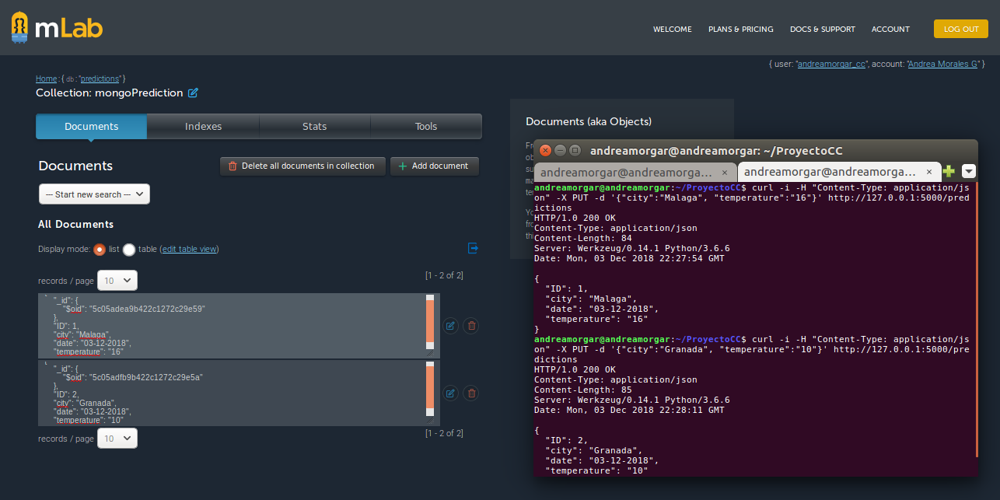
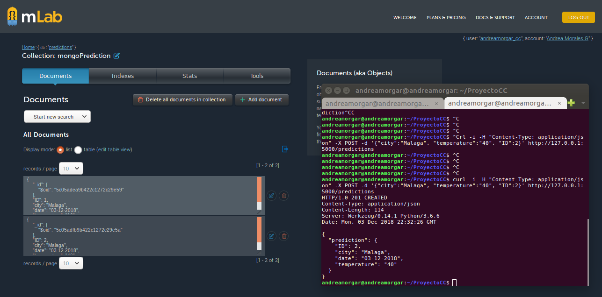
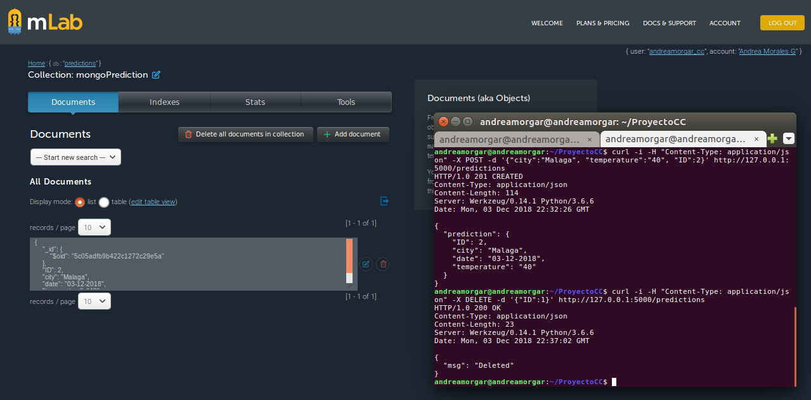
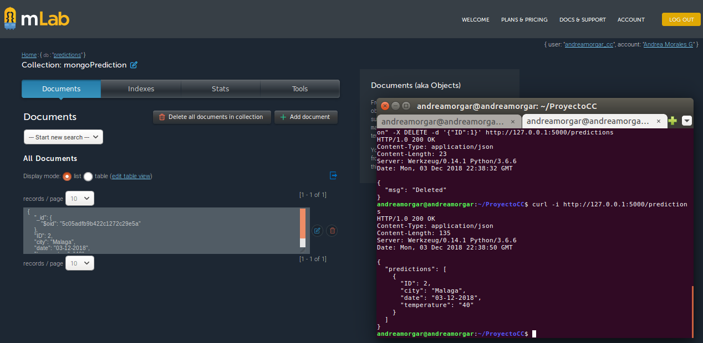

### Base de datos para el servicio

#### Instalación de las herramientas necesarias
Como avance del proyecto, se ha añadido una base de datos donde guardar las predicciones que se van añadiendo al servicio mediante PUT. Obviamente, también se permitirá el acceso, modificación y borrado de dichas predicciones. Para ello, se ha hecho uso de [mLab](https://mlab.com/), una  *Database-as-a-Service* para *MongoDB* (la herramienta que se decidió utilizar para ello).

Como estamos programando el proyecto en Python, debemos instalar *pymongo* para poder trabajar con mLab. Esto podemos hacerlo ejecutando la siguiente orden.

~~~
$ pip3 install pymongo
~~~

Sin embargo, hay que tener en cuenta un detalle, y es que le hemos añadido una nueva librería a nuestro servicio. Esto implica, que debe ir añadida en *requirements.txt* para que nuestra aplicación pueda pasar los tests y desplegarse de forma correcta. [Aquí](https://github.com/andreamorgar/ProyectoCC/blob/master/requirements.txt) se puede acceder al fichero *requirements.txt* ya actualizado.

#### Funcionalidad añadida

Para poder llevar a cabo el añadido de una base de datos, lo primero es crearse una cuenta en mLab, y crear la base de datos con la que se va a trabajar. Una vez completado estos pasos, podemos pasar a la parte de programación.

Se ha hecho uso de un fichero, al que se le ha denominado [predictionDB.py](https://github.com/andreamorgar/ProyectoCC/blob/master/predictionDB.py), en el cuál se han añadido todas las funciones necesarias para poder utilizar la base de datos que hemos creado. Las funciones creadas, son las siguientes:

- **getDocument(ID)**: devuelve un documento de la base de datos, cuyo ID coincida con el pasado por parámetro. Este documento se corresponde con una predicción concreta con la que puede trabajar nuestro servicio.
- **pushDocument(document)**: añade el documento (predicción) *document* a la base de datos.
- **updateDocument(document,update)**: actualiza el documento (predicción) *document* con la información en *update*.
- **delete_document(document)**: borra de forma permanente el documento (predicción) *document* la base de datos.
- **get_all_predictions()**: devuelve un elemento de tipo cursor con todos los documentos (predicciones) almacenados en la base de datos en ese momento.
- **get_number_documents()**: devuelve el número de predicciones que hay actualmente en la base de datos
- **delete_all_documents()**: borra de forma permanente todos los documentos (predicciones) de la base de datos

Con las funciones anteriores, es suficiente para mantener la funcionalidad que teníamos en el hito anterior, con la diferencia de que ahora existe persistencia en los datos.

#### Modificación del fichero que implementa Flask
Se han modificado las distintas funciones utilizadas en el fichero que implementa el servicio Rest para que éste se comunique con la base de datos, mediante las funciones detalladas en la sección anterior. De esta forma, se ha prescindido de la estructura de tipo vector que almacenaba de forma temporal las predicciones de la base de datos en las ejecuciones del servicio previas al avance. Se puede ver el contenido actual del fichero que implementa el servicio de la aplicación [aquí](https://github.com/andreamorgar/ProyectoCC/blob/master/app_flask.py)

#### Funcionamiento de la base de datos
Podemos ver en la siguiente imagen cómo se vería la base de datos y sus documentos (que como ya hemos mencionado, representan las distintas predicciones). En dicha imagen podemos ver cómo se ha hecho PUT de dos predicciones, las cuáles, (tras refrescar mLab), podemos ver que están en una colección de la base de datos.

Podemos ahora intentar modificar la segunda predicción, mediante POST. Tal y como vemos en la siguiente imagen, el funcionamiento es correcto.

De igual forma podemos ver el funcionamiento para DELETE. Vamos a probar a eliminar la primera predicción. En la imagen siguiente se puede ver cómo la acción es llevada a cabo de forma correcta.

Por último, vamos a imprimir las distintas predicciones que se encuentran en la base de datos, para comprobar que el acceso a la información de la base de datos se lleva a cabo de manera correcta. De nuevo, en la siguiente imagen, podemos ver que se lleva a cabo de manera correcta.

#### Testeo de la nueva funcionalidad
Se ha añadido al directorio *Test*, el fichero [test_database.py](https://github.com/andreamorgar/ProyectoCC/blob/master/test/test_database.py), un test que se encarga de probar el funcionamiento correcto de cada una de las funciones de la base de datos detalladas anteriormente. Este test, se añade a todos los que teníamos anteriormente, a la hora de desplegar el proyecto.

Como se ha dicho, comprueba que la gestión de la base de datos se realiza de forma adecuada. Ello implica, que la inserción, borrado, modificación y acceso a las predicciones se hace correctamente, además de otros aspectos como que el número de documentos en la base de datos sea correcto, que la información insertada sea la correcta y de la forma correcta, etc.

#### Información útil para este avance del proyecto
[Tutorial para usar mongo](https://datawookie.netlify.com/blog/2016/09/python-first-steps-with-mongodb/)

[Tutorial para usar mLab](https://gist.github.com/nikhilkumarsingh/a50def43d8d425b4108c2f76edc1398e)
