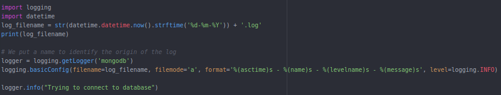
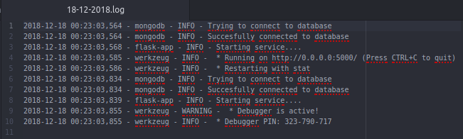

# Sistema de Logs
Para este hito, vamos a realizar un avance en el proyecto, que consiste en añadir la utilidad de logs a nuestra aplicación.

Los logs son uno los aspectos más importantes en las arquitecturas software. De hecho, tal y como hemos visto en la asignatura, existen arquitecturas totalmente orientadas al trabajo con logs, y ya es algo indispensable en las arquitecturas modernas.

Para poder añadir la gestión de logs a este proyecto, vamos a utilizar la librería **logging** de Python, que nos permitirá poder gestionar los distintos mensajes que se deban enviar en nuestra aplicación. Principalmente queremos manejar mensajes de logs para dos aspectos diferentes:

1. En primer lugar, **todos aquellos que provienen de nuestra aplicación** realizada con Flask. Aquí tendremos en cuenta tanto el arranque de la aplicación, las distintas peticiones que se llevan a cabo, y todos los mensajes de Logs generados por la aplicación en sí.

2. Por otra parte, **se utilizarán mensajes de logs para indicar los distintos accesos y peticiones a la base de datos que está conectada a nuestra aplicación**.

### Implementación

Para poder implementar esta funcionalidad, lo primero es importar la librería **logging** a los ficheros con los que estamos trabajando.Una vez importado, ya podemos comenzar a manejar los logs de nuestra aplicación, y también a generar aquellos que consideremos necesarios.

Para ello, hay que destacar los siguientes aspectos:

- Podemos modificar el formato de los mensajes de logs a nuestro gusto. En mi caso, he considerado mostrar, en cada mensaje de logs, la hora, el origen del mensaje de log, el propio mensaje en sí y el tipo de mensaje (que puede ser *DEBUG, INFO, WARNING, ERROR* o *CRITICAL*). Esta información se especifica en una función llamada *basicConfig(...)* de la librería ya mencionada.

- Además, para guardar toda la información en un fichero, podemos especificarlo también, con la opción "a" que hace referencia a **append**, de forma que siempre estemos añadiendo información al fichero y nunca sobreescribamos el contenido del mismo. Este aspecto también se especifica en la función  *basicConfig(...)* previamente mencionada.

- Por otra parte, tenemos que especificar de alguna manera el origen o nombre de donde proviene el mensaje de log, ya que nos permitirá identificar su procedencia. Para ello, podemos utilizar una función llamada *getLogger(<nombre>)*, en la cual indicaremos el nombre con el que queremos identificar la procedencia de ese log. Posteriormente, podremos generar mensajes de logs, asociados a dicho identificador.

- En cuanto al fichero en el que se almacenan todos los mensajes de logs, hay que mencionar que no hay uno solo, sino que se generará un fichero distinto por cada día en el que se generen nuevos mensajes de logs. De esta forma, podemos gestionar la memoria asociada a los ficheros que almacenan mensajes de logs de una manera rápida y sencilla  (y de camino, organizar los mensajes que se generen).

En la siguiente imagen, podemos ver el código necesario para llevar a cabo los puntos comentados. Podemos ver, en ella, una pequeña fracción de código correspondiente a la implementación de toda la funcionalidad anterior, en este caso, para el caso de la base de datos.

### Visualización de los mensajes de logs generados

A continuación podemos ver un ejemplo de cómo podría verse el contenido del fichero de logs para un día concreto en el cuál arrancamos la aplicación.

---

### Material interesante para la realización de este avance

- [Documentación oficial para gestionar logs en Python](https://docs.python.org/3.1/library/logging.html#configuring-logging)

- [Tutorial de iniciación a *Logging*](https://realpython.com/python-logging/).

<!--Podríamos guardar los logs en una nueva colección de la base de datos, como viene indicado [aquí](https://stackoverflow.com/questions/8103864/logging-to-mongodb-from-python)-->
