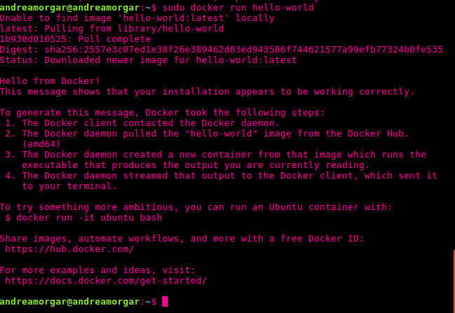

## Pasos para instalar Docker

~~~
$ sudo apt-get update

$ sudo apt-get install \
    apt-transport-https \
    ca-certificates \
    curl \
    gnupg2 \
    software-properties-common

$ curl -fsSL https://download.docker.com/linux/ubuntu/gpg | sudo apt-key add -

$ sudo apt-key fingerprint 0EBFCD88

~~~

~~~

$ sudo add-apt-repository \
   "deb [arch=amd64] https://download.docker.com/linux/ubuntu \
   $(lsb_release -cs) \
   stable"

$ sudo apt-get update

$ sudo apt-get install docker-ce
~~~

~~~

$ sudo docker run hello-world

~~~

