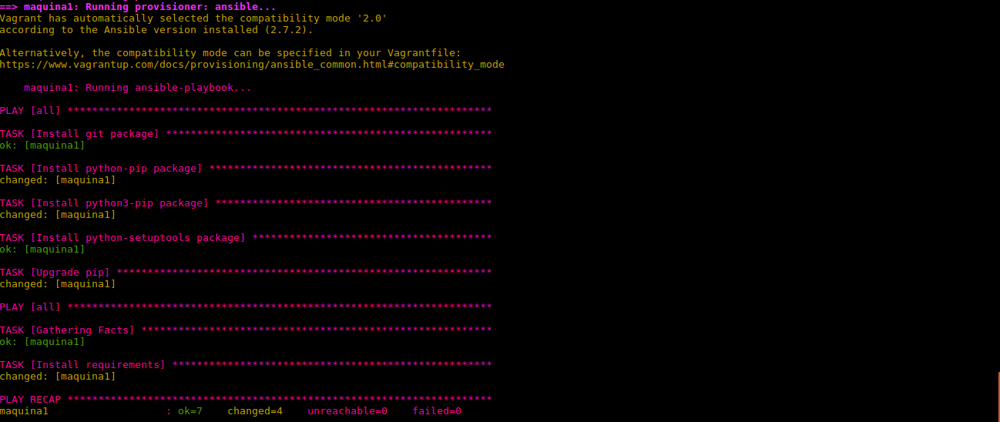
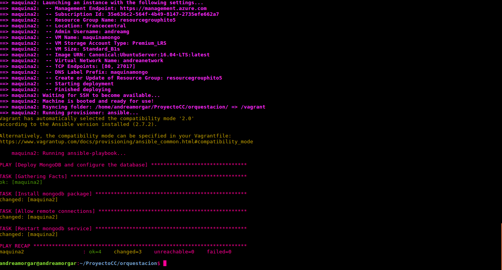
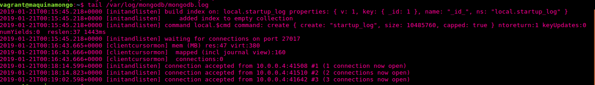
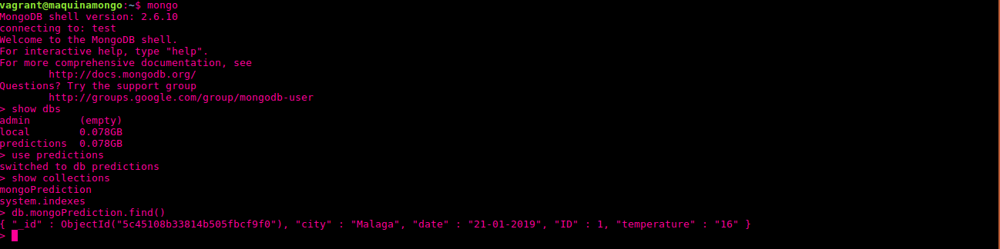

# Orquestación de máquinas virtuales

En este hito, vamos a realizar la orquestación de dos máquinas virtuales en Azure, donde una de las máquinas alojará la base de datos, y la otra, el servicio REST que estamos desarrollando (el cuál hace uso de dicha base de datos, ya que es de donde adquiere la información). Para ello, haremos uso de [Vagrant](https://www.vagrantup.com/), una herramienta para la creación y configuración de entornos de desarrollo.

En esta documentación veremos dos cuestiones principales:
1.  Cómo empezar a trabajar desde Vagrant con Azure, y cómo podemos, desde VagrantFile, crear dos máquinas virtuales en Azure con la misma red interna, de forma que podamos realizar una conexión entre ellas a nivel de red interna.

2. Provisionar una máquina virtual con MongoDB, de forma que escuche las peticiones de la otra máquina orquestada.

## Primeros pasos con Vagrant

En primer lugar, tenemos que empezar por la instalación de Vagrant en nuestro ordenador, de forma que podamos utilizar dicha herramienta , y así poder trabajar directamente con el Vagrantfile y la especificación concreta de las máquinas que queramos utilizar.

Sin embargo, como ya utilicé Vagrant en el **Hito 3** para realizar el provisionamiento de máquinas virtuales en local, los pasos para empezar a trabajar con Vagrant desde local se pueden consultar en [la documentación del hito mencionado](https://github.com/andreamorgar/ProyectoCC/blob/master/provision/README.md). **En este documento, se puede ver detalladamente cómo hacer la instalación de Vagrant, y la creación y provisionamiento de una máquina virtual en local (mediante VirtualBox).**

## Vagrant con Azure

Como ya se ha comentado en la introducción de la documentación, se pretende usar Vagrant para crear dos máquinas virtuales en Azure:

- La primera máquina, a la que nos referiremos como `maquinaservicio`, **se encargará de alojar el servicio REST**. Por tanto, la provisión de esta máquina se corresponderá, con la que hemos llevado a cabo hasta ahora, ya que necesitaremos que la máquina disponga de todos los paquetes necesarios para poder ejecutar el proyecto (como puede ser el caso de *Flask*, o *Python3* en el caso de que no estuviera instalado por defecto).

- La segunda máquina, a la que nos referiremos como `maquinamongo`  será la que tenga alojado un servicio de MongoDB. De esta forma, cada vez que se realice al servicio REST una petición  que necesite información almacenada a la base de datos, se accederá a la información que contiene la base de de datos de `maquinamongo`.

Para llevar a cabo todo el desarrollo necesario, se ha realizado desde el directorio [`ProyectoCC/orquestacion`](https://github.com/andreamorgar/ProyectoCC/tree/master/orquestacion) del repositorio del proyecto. En este directorio, ejecutamos la siguiente orden para poder crear el fichero Vagrantfile y comenzar a trabajar con *Vagrant*.
~~~
$ vagrant init
~~~

### <u>Configuración para una máquina en Azure<u/>
Tras ejecutar la orden anterior en el directorio en el que queramos trabajar con Vagrant, se nos creará el fichero *Vagrantfile*. Al realizar dicha orden, se nos crea un contenido por defecto, pero en este caso, lo borraremos y lo sustituiremos por uno apropiado para poder trabajar con Azure.

Lo primero es descargar el plugin de Azure, y así poder configurar todo para poder trabajar con Vagrant en Azure. Siguiendo los pasos vistos en [el Github de Azure](https://github.com/Azure/vagrant-azure), podemos obtener este plugin con las siguientes órdenes:

~~~
$ vagrant box add azure https://github.com/azure/vagrant-azure/raw/v2.0/dummy.box --provider azure
$ vagrant plugin install vagrant-azure
~~~

A continuación, creamos el fichero Vagrantfile tal y como viene especificado  

Para empezar, vamos a configurar un Vagrantfile partiendo del básico que se nos facilita en la [documentación oficial](https://github.com/Azure/vagrant-azure), añadiendole una configuración adicional de forma que podamos crear una máquina virtual de acuerdo a lo que necesitemos. De esta forma podremos crear una máquina virtual que cumpla con las mismas especificaciones que las máquinas de Azure que creamos con el CLI de Azure en el hito anterior. El resultado, sería el que se muestra a continuación.

~~~
require 'vagrant-azure'
Vagrant.configure('2') do |config|
  config.vm.box = 'azure'

  # Usamos una clave ssh local para conectar al box de vagrant remoto
  config.ssh.private_key_path = '~/.ssh/id_rsa'
  config.vm.provider :azure do |az|

    # Cada uno de los valores siguientes se deben declarar en variables de entorno con el nombre que se especifica.
    az.tenant_id = ENV['AZURE_TENANT_ID']
    az.client_id = ENV['AZURE_CLIENT_ID']
    az.client_secret = ENV['AZURE_CLIENT_SECRET']
    az.subscription_id = ENV['AZURE_SUBSCRIPTION_ID']

    az.vm_image_urn = 'Canonical:UbuntuServer:16.04-LTS:latest'
    az.vm_name = 'maquinaservicio'
    az.vm_size = 'Standard_B1s'
    az.resource_group_name = 'resourcegrouphito5'
    az.location = 'francecentral'
    az.tcp_endpoints = 80
  end
end
~~~

Respecto al contenido del Vagrantfile anterior, debemos destacar algunas cuestiones, que se mencionarán posteriormente:
- El uso de **variables de entorno** que deberán estar declaradas en nuestra máquina.
- **Otros parámetros (adicionales) para personalizar la máquina virtual** a las necesidades del proyecto
- Especificación del **provider de Azure**

##### Uso de variables de entorno

Nos podemos ver con un "problema" inicial, y es que se están haciendo uso de variables de entorno que no tenemos declaradas en nuestro sistema. Por tanto, previamente, nosotros debemos exportar como variables de entorno esos valores, porque sino no se van a detectar. Como podemos ver en este [otro tutorial secundario](https://blog.scottlowe.org/2017/12/11/using-vagrant-with-azure/), en concreto, deberemos especificar el valor de los siguientes parámetros:
- `az.tenant_id`
- `az.client_id`
- `az.client_secret `
- `az.subscription_id `

Los tres primeros parámetros (*tenant_id*, *client_id*, *client_secret*), podemos obtenerlos de la salida que nos proporciona la siguiente orden:
~~~
$ az ad sp create-for-rbac
~~~

Respecto al último de los parámetros, el cuál se corresponde con el ID de la suscripción en Azure, podemos obtenerlo ejecutando la siguiente orden con el cliente de Azure por línea de órdenes:
~~~
$ az account list --query '[?isDefault].id' -o tsv
~~~

Una vez tenemos los valores correspondientes, nos basta con crearnos variables de entorno con el mismo nombre de las utilizadas en el VagrantFile anterior de la siguiente forma:
~~~
$ export AZURE_TENANT_ID=xxxxxxx-xxxx-xxxx-xxxx-xxxxxxxxxxxx
$ export AZURE_CLIENT_ID=xxxxxxx-xxxx-xxxx-xxxx-xxxxxxxxxxxx
$ export AZURE_CLIENT_SECRET=xxxxxxx-xxxx-xxxx-xxxx-xxxxxxxxxxxx
$ export AZURE_SUBSCRIPTION_ID=xxxxxxx-xxxx-xxxx-xxxx-xxxxxxxxxxxx
~~~

##### Otros parámetros adicionales en Vagrantfile
Además, le podemos añadir una serie de líneas que nos permitan especificar aspectos concretos de la máquina virtual que queremos crear, como puede ser el nombre de la máquina, el grupo de recursos asociado, o la región a utilizar. Concretamente, especificaremos todos los parámetros con los que hemos ido trabajando hasta ahora:
- Imagen de Ubuntu Server con la versión 16.04.5 (LTS).
- Grupo de recursos en la región **Francia Central**, ya que como vimos en el hito anterior, fue con la que obtuvimos mejores resultados.
- Tamaño de la máquina virtual **Standard_B1s**.
- Abrimos el **puerto 80**, que es desde el que ejecutamos la aplicación.

Con estos añadidos, se crearía una máquina con las mismas características que la del hito anterior.

#### Uso del provider de Azure

Para especificar que estamos trabajando con Azure podemos hacerlo de dos formas diferentes:

1. Indicándolo por línea de órdenes al hacer `vagrant up`, de la siguiente forma:
~~~
$ vagrant up --provider=azure
~~~

2. Indicándolo al inicio del fichero Vagrantfile, con `require`, y el plugin del proveedor de Azure que nos descargamos previamente de la siguiente forma: `require 'vagrant-azure'`.

En este caso, me he decantado por la segunda opción y se ha definido dentro del Vagrantfile. Esto se debe a que, tal y como se comentó en clase, de esta manera podremos hacer `require` de todo lo que necesitemos, y hacer así la orquestación dentro del fichero Vagrant de todas las máquinas virtuales que queramos.

### <u>Orquestación de máquinas virtuales<u/>
Una vez sabemos lo básico de cómo crear desde Vagrant una máquina en Azure, deberemos realizar el proceso para crear dos máquinas, el cuál es el que se ha definido en el Vagrantfile. Para ello, partiendo del Vagrantfile de ejemplo que he mostrado en la sección anterior, se han definido dos máquinas virtuales, cada una con su nombre y sus especificaciones necesarias. Como ayuda para la creación de más de una máquina, se ha consultado [este enlace](https://www.rubydoc.info/gems/vagrant-azure/1.3.0) comentado en clase.

**Desde [este enlace](https://github.com/andreamorgar/ProyectoCC/blob/master/orquestacion/Vagrantfile) podemos acceder al contenido del Vagrantfile resultante**. De dicho fichero, los aspectos más relevantes y que se deben destacar son los siguientes:

- Ambas máquinas pertenecen al **mismo grupo de recursos**.

- Para cada una de las máquinas, **se ha realizado su provisionamiento** con el playbook correspondiente. En el caso de la máquina `maquinaservicio`, se realizará el aprovisionamiento como lo hemos realizado hasta ahora, y en el caso de la máquina `maquinamongo`, utilizaremos un nuevo playbook que se encarga de provisionar la máquina virtual con mongo, además de configurar y reiniciar el servicio.

- **Se han abierto los puertos correspondientes** para que se pueda ejecutar la aplicación.
  - El puerto 80 para acceder al servicio REST
  - El puerto 27017 que el que utiliza *MongoDB* por defecto.

- **Se ha definido una red interna** llamada `andreanetwork` que permitirá poder comunicar las máquinas mediante la red interna.

**De esta forma, tan solo con ejecutar la orden `vagrant up --no-parallel`, podremos crear y provisionar dos máquinas en azure, con los requisitos  y configuración necesaria para el proyecto**. Es necesario añadir la opción mencionada (`--no-parallel`), ya que de otra forma, al intentar crear las máquinas en paralelo, al estar usando el mismo grupo de recursos, se producen errores relacionados con la asignación de direcciones. De hecho, si se consulta la [documentación oficial](https://www.vagrantup.com/docs/cli/up.html), podemos ver que esta opción debe ser utilizada siempre y cuando el provider en cuestión no permita la creación paralela de las máquinas virtuales, como resulta ser el caso en cuestión.

### <u>Aprovisionamiento de las máquinas virtuales<u/>

#### Aprovisionamiento de la máquina que aloja el servicio rest

###### Copiar ficheros en la máquina virtual desde Vagrant
En primer lugar, mencionar que, tal y como se recomendó en clase, uno de los cambios realizados en este hito consiste en copiar en la máquina únicamente aquellos ficheros que hagan falta para ejecutar la aplicación (y no todo el contenido que tenemos en el repositorio de Github, como pueden ser los ficheros de documentación o las imágenes utilizadas en dichas documentaciones).
Esto podemos llevarlo a cabo con `file`, tal y como podemos ver en la [documentación oficial](https://www.vagrantup.com/docs/provisioning/file.html).

En nuestro caso, pondremos en el fichero Ansiblefile la siguiente línea (siendo <fichero> el fichero en cuestión que queremos copiar en la máquina):
~~~
maquina1.vm.provision "file", source: "../<fichero>", destination: "/home/vagrant/ProyectoCC/<fichero>"
~~~

Concretamente, indicamos `maquina1` porque es la máquina que queremos provisionar con dichos ficheros (en este caso concreto).

###### Provisionamiento con el playbook.yml
Para terminar el provisionamiento desde Vagrant, una vez que se ha creado la máquina virtual `maquina1` (la cual alojará el servicio REST) realizamos lo siguiente, siendo [playbook.yml](https://github.com/andreamorgar/ProyectoCC/blob/master/orquestacion/playbook.yml) el playbook que provisiona el servicio REST.

~~~
maquina1.vm.provision "ansible" do |ansible|
  ansible.playbook = "playbook.yml"
end
~~~

Este [playbook.yml](https://github.com/andreamorgar/ProyectoCC/blob/master/orquestacion/playbook.yml), previamente mencionado, está basado en el realizado para el Hito 3, excepto por dos modificaciones:
1. Ya proporcionamos, en el Vagrantfile, los ficheros necesarios para ejecutar el proyecto con `file`, por lo que no necesitamos ni instalar git ni por tanto, clonar el repositorio en cuestión.

2. Por problemas, al parecer, de sincronización, no me funcionaba la instalación con apt de varios paquetes en la misma tarea, por lo que se ha desglosado en distintas tareas dentro del mismo playbook (con igual funcionalidad).

#### Aprovisionamiento de la máquina que aloja la base de datos

Para poder realizar la orquestación de dos máquinas, se ha avanzado el proyecto de forma que podamos provisionar una máquina con MongoDB en local (hasta ahora utilizábamos *mLab*).

Para provisionar la máquina virtual con MongoDB se ha llevado a cabo la realización de un *playbook* al que hemos denominado [playbook-mongodb.yml](https://github.com/andreamorgar/ProyectoCC/blob/master/orquestacion/playbook-mongodb.yml). La información completa acerca de cómo se lleva a cabo la provisión se encuentra en [este enlace](https://github.com/andreamorgar/ProyectoCC/blob/master/docs/provisionamiento_mongo.md).

Por tanto, para provisionar desde Vagrant, una vez que se ha creado la máquina virtual `maquina2` realizamos lo siguiente:
~~~
maquina2.vm.provision "ansible" do |ansible|
  ansible.playbook = "playbook-mongodb.yml"
end
~~~

## Funcionamiento del Proyecto
Por último, se va a mostrar que, simplemente con lo proporcionado en el fichero Vagrantfile y los playbook de provisionamiento, podemos desplegar en la nube las máquinas virtuales con correcto y total funcionamiento.

Para ello, nos situamos en primer lugar en el directorio `orquestacion` de este repositorio, y ejecutamos la orden `vagrant up --no-parallel` como ya ha sido comentado en secciones anteriores de este documento. Para ello, se han tenido que especificar las variables de entorno relacionadas con la suscripción y cliente de Azure, tal y como ya se comentó previamente.

En la siguiente imagen se puede ver, cómo efectivamente, comienza la creación de las dos máquinas. Al haber especificado explícitamente que queremos que no se lleve a cabo una creación en paralelo de ambas máquinas, primero se va a crear y provisionar la primera de ellas (que en este caso se corresponde con la que aloja el servicio, la cual se llama **maquinaservicio**) yen segundo lugar se creará y provisionará la que alojará la base de datos (llamada **maquinamongo**).

Una vez finalice la creación y despliegue de la primera de las máquinas, se procederá al provisionamiento de la misma, que, tal y como se puede ver en la imagen que se muestra a continuación, finaliza de forma correcta.

Del mismo modo que se ha llevado a cabo para la primera de las máquinas, se procede a la creación y provisionamiento de la segunda máquina (**maquinamongo**), que, tal y como se muestra en la siguiente imagen, también se crea y se provisiona de manera correcta.

Una vez finalizado este proceso, accedemos mediante ssh a la primera de las máquinas. Al hacer `cd Proyecto`, y posteriormente `ls`, podemos ver cómo únicamente se han copiado los archivos necesarios, y no el proyecto de Github al completo, tal y como habíamos especificado en la sección de provisionamiento de esta máquina. Al ejecutar el servicio, podemos ver en la siguiente imagen, que arranca sin problemas.

Hacemos un paso homólogo para la máquina que tiene mongo, y consultamos el estado del servicio correspondiente a la base de datos. Tal y como se ve en la imagen que se encuentra a continuación, el servicio está funcionando sin problema.

Ahora, una vez comprobado el funcionamiento de ambas máquinas, abrimos una nueva terminal, y accedemos a la ruta raiz del servicio, y tal y como se puede ver, devuelve `status:OK`.

Sin embargo, con esta petición no estariamos accediendo a la base de datos, y por tanto no estamos comprobando que realmente funcione la conexión con la misma. Por ello, accedemos a una ruta que sí que sabemos que se conecta a la base de datos: la que muestra las peticiones. A continuación podemos ver cómo accede (aunque como no hay predicciones almancenadas, no tiene contenido).

Para ver que realmente funciona, podemos irnos a la máquina `maquinamongo`,y consultar los últimos logs registrados en el fichero de logs de Mongo, el cuál se encuentra en la ruta `/var/log/mongodb/mongodb.log`. Tal y como se puede ver en la siguiente imagen, realmente estamos accediendo al servicio desde la IP `10.0.0.4`

Para asegurarnos, vamos a comprobar que esta IP se corresponda con la de la máquina que ejecuta el servicio. Como se muestra en la siguiente imagen, podemos ver que efectivamente es así, por lo cuál se está realizando la petición de la manera correcta y esperada.

Por último, desde la terminal de mi ordenador personal, desde donde estamos realizando las consultas, vamos a realizar un PUT de una predicción, tal y como se muestra a continuación. Podemos ver en la siguiente imagen, que el PUT se realiza de manera correcta, y que al acceder a la ruta que muestra las predicciones, ésta predicción se muestra.

Si además, accedemos a la base de datos de Mongo en la máquina virtual `maquinamongo`, podemos ver que efectivamente está almacenada dicha predicción.

Por tanto, tanto la creación, como el provisionamento y el funcionamiento de la máquina se llevan a cabo de manera correcta.
