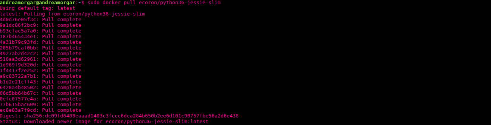

# Contenedores para despliegue en la nube

## Instalación
https://docs.docker.com/install/linux/docker-ce/ubuntu/
~~~
$ sudo apt-get update

$ sudo apt-get install \
    apt-transport-https \
    ca-certificates \
    curl \
    gnupg2 \
    software-properties-common

$ curl -fsSL https://download.docker.com/linux/ubuntu/gpg | sudo apt-key add -

$ sudo apt-key fingerprint 0EBFCD88

~~~

~~~

$ sudo add-apt-repository \
   "deb [arch=amd64] https://download.docker.com/linux/ubuntu \
   $(lsb_release -cs) \
   stable"

$ sudo apt-get update

$ sudo apt-get install docker-ce
~~~

~~~

$ sudo docker run hello-world

~~~

### Pruebo debianSlim:

Cojo la imagen de [aquí](https://hub.docker.com/r/ecoron/python36-jessie-slim).

---

### Comandos utilizados importantes

`sudo docker images`: para listar las imágenes que tenemos instaladas

`sudo docker run -it alpine sh`:  

`docker image rm ID`: para borrar una imagen [ver]https://linuxize.com/post/how-to-remove-docker-images-containers-volumes-and-networks/

### Algunos conceptos sobre Docker
- Con el dockerfile defines una imagen
- Desde docker podemos usar imágenes ya publicadas. Nosotras buscamos crear nuestra imagen propia.
- En el dockerfile se puede hacer la provisión como ansible.

Dockerfile -> imagen -> contenedor

Imagen: el SO con lo que definimos en dockerfile

Contenedor: es la ejecución de una imagen. CUando ejecutas una imagen se crea un contenedor.

### dockerfile
https://docs.docker.com/get-started/part2/

### Test Dockerfile

https://medium.com/@aelsabbahy/tutorial-how-to-test-your-docker-image-in-half-a-second-bbd13e06a4a9

## Alpine + MongoDB

He cogido la imagen de [aqui](https://hub.docker.com/r/mvertes/alpine-mongo/). Ahi viene como usar MongoDB

### Justificación

Razones por las que usar alpine ([ver](https://nickjanetakis.com/blog/the-3-biggest-wins-when-using-alpine-as-a-base-docker-image)).
